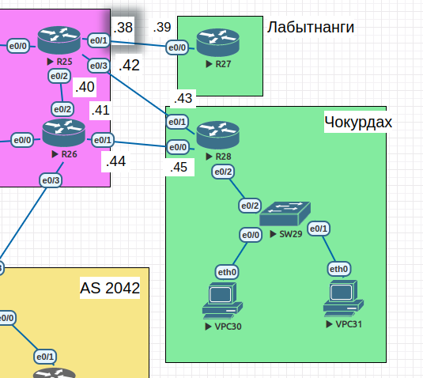

#  PBR

### Цель:

 - Настроить политику маршрутизации в офисе Чокурдах
 - Распределить трафик между 2 линками

###  Задание:

 1. Настроить политику маршрутизации для сетей офиса.
 1. Распределить трафик между двумя линками с провайдером.
 1. Настроить отслеживание линка через технологию IP SLA.(только для IPv4)
 1. Настройть для офиса Лабытнанги маршрут по-умолчанию.


### 1 Настроить политику маршрутизации для сетей офиса.

- Рассмотрим следущий участок сети из прошлой работы.

#### 1.1 Схема сети.



#### 1.2 Таблица адресации.

 | Device        | Interface     | IP address      | Subnet mask     | Default gateway |
 | ------------- | ------------- | --------------- | --------------- | --------------- |
 | R25           | e0/0          | 10.0.0.33       | 255.255.255.254 | N/A             |
 |               | e0/1          | 10.0.0.38       | 255.255.255.254 | N/A             |
 |               | e0/2          | 10.0.0.40       | 255.255.255.254 | N/A             |
 |               | e0/3          | 10.0.0.42       | 255.255.255.254 | N/A             |
 | R26           | e0/0          | 10.0.0.37       | 255.255.255.254 | N/A             |
 |               | e0/1          | 10.0.0.44       | 255.255.255.254 | N/A             |
 |               | e0/2          | 10.0.0.41       | 255.255.255.254 | N/A             |
 |               | e0/3          | 10.0.0.25       | 255.255.255.254 | N/A             |
 | R27           | e0/0          | 10.0.0.39       | 255.255.255.254 | N/A             |
 | R28           | e0/0          | 10.0.0.45       | 255.255.255.254 | N/A             |
 |               | e0/1          | 10.0.0.43       | 255.255.255.254 | N/A             |
 |               | e0/2.10       | 192.168.102.1   | 255.255.255.128 | N/A             |
 |               | e0/2.20       | 192.168.102.129 | 255.255.255.128 | N/A             |
 |               | e0/2.40       | 172.16.102.1    | 255.255.255.0   | N/A             |
 | SW29          | VLAN40        | 172.16.102.10   | 255.255.255.0   | 172.16.102.1    |
 | VPC30         | e0/0          | 192.168.102.10  | 255.255.255.128 | 192.168.102.1   |
 | VPC31         | e0/0          | 192.168.102.139 | 255.255.255.128 | 192.168.102.129 |

#### 1.3 Таблица VLAN.

| VLAN         | Name        | Interface assigned             |
| ------------ | ----------- | ------------------------------ |
| 1            | N/A         | N/A                            |
| 10           | VPC30       | SW29: e0/0                     |
| 20           | VPC31       | SW29: e0/1                     |
| 40           | Management  | SW29: vlan40, R28: vlan40      |
| 999          | Native      | N/A                            |

#### 1.4 Настройка статической маршрутизации
 - R28
```
R28(config)#ip route add 0.0.0.0 0.0.0.0 10.0.0.42
R28(config)#ip route add 0.0.0.0 0.0.0.0 10.0.0.44
```
 - R26
```
R26(config)#ip route add 0.0.0.0 0.0.0.0 10.0.0.40
R26(config)#ip route 192.168.102.0 255.255.255.0 10.0.0.45
```
 - R27
```
R27(config)#ip route add 0.0.0.0 0.0.0.0 10.0.0.38
```
 - R25
 ```
 R25(config)#ip route 192.168.102.0 255.255.255.0 10.0.0.43
 ```
 - Проверяем пинг и трейс с VPC30
 ```
 VPC30> ping 10.0.0.39

84 bytes from 10.0.0.39 icmp_seq=1 ttl=253 time=2.086 ms

VPC30> trace 10.0.0.39
trace to 10.0.0.39, 8 hops max, press Ctrl+C to stop
 1   192.168.102.1   1.994 ms  0.907 ms  0.886 ms
 2   10.0.0.44   1.431 ms  0.925 ms  0.968 ms
 3   10.0.0.40   1.877 ms  1.323 ms  1.304 ms
 4   *10.0.0.39   1.571 ms (ICMP type:3, code:3, Destination port unreachable)
 ```

 - Проверяем пинг и трейс с VPC31
 ```
 VPC31> ping 10.0.0.39

84 bytes from 10.0.0.39 icmp_seq=1 ttl=253 time=1.890 ms

VPC31> trace 10.0.0.39
trace to 10.0.0.39, 8 hops max, press Ctrl+C to stop
1   192.168.102.129   0.717 ms  0.896 ms  0.729 ms
2   10.0.0.42   1.314 ms  1.629 ms  1.367 ms
3   *10.0.0.39   1.670 ms (ICMP type:3, code:3, Destination port unreachable)  *

 ```
#### 1.4 Настройка routemap
- Создаю routemap для vlan10 и вешаю его на соответствующий интерфейс.
```
R28(config)#route-map vlan10 permit 10
R28(config-route-map)#set ip default next-hop 10.0.0.42
R28(config-route-map)#exit
R28(config)#interface e0/2.10
R28(config-subif)#ip policy route-map vlan10
```
- Проверяю с VPC30
```
VPC30> trace 10.0.0.39
trace to 10.0.0.39, 8 hops max, press Ctrl+C to stop
 1   192.168.102.1   1.101 ms  0.797 ms  0.776 ms
 2   10.0.0.42   1.373 ms  1.531 ms  1.118 ms
 3   *10.0.0.39   1.115 ms (ICMP type:3, code:3, Destination port unreachable)  *
```
- Для vlan20 определяю второй роутер.
```
R28(config)#route-map vlan20 permit 20
R28(config-route-map)#set ip default next-hop 10.0.0.44
R28(config-route-map)#exit
R28(config)#interface e0/2.20
R28(config-subif)#ip policy route-map vlan20
```
- Проверяю с VPC31
```
VPC31> trace 10.0.0.39
trace to 10.0.0.39, 8 hops max, press Ctrl+C to stop
 1   192.168.102.129   0.946 ms  0.567 ms  0.628 ms
 2   10.0.0.44   0.996 ms  0.715 ms  0.844 ms
 3   10.0.0.40   0.984 ms  0.843 ms  1.019 ms
 4   *10.0.0.39   1.333 ms (ICMP type:3, code:3, Destination port unreachable)  *
```
