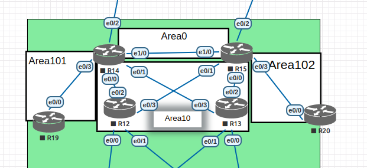

#  OSPF

## Цель

 - Настроить OSPF офисе Москва
 - Разделить сеть на зоны
 - Настроить фильтрацию между зонами

##  Задание:

 1. Маршрутизаторы R14-R15 находятся в зоне 0 - backbone.
 2. Маршрутизаторы R12-R13 находятся в зоне 10. Дополнительно к маршрутам должны получать маршрут по умолчанию. (stub)
 3. Маршрутизатор R19 находится в зоне 101 и получает только маршрут по умолчанию. (total stub)
 4. Маршрутизатор R20 находится в зоне 102 и получает все маршруты, кроме маршрутов до сетей зоны 101. (normal + filter)

- Настройка для IPv6 повторяет логику IPv4.
- План работы и изменения зафиксированы в документации .
- Документация оформлена на github. (желательно использовать markdown).
- Если нужна помощь - пишите через ЛК с помощью кнопки "чат с преподавателем" или в канал в Telegram.


### 1 Подготовительные действия.

#### 1.1 Топология.

 - Для того, чтобы между R14 и R15 существовала Зона 0, они должны быть объединены линком. Для этого надо поднять дополнительный интерфейс между ними и настроить адреса.


#### 1.2 Схема сети



#### 1.3 Таблица адресации

| Device        | Interface     | IP address      | Subnet mask     | Default gateway |
| ------------- | ------------- | --------------- | --------------- | --------------- |
| VPC1          | e0/0          | 192.168.100.10  | 255.255.255.128 | 192.168.100.1   |
| SW2           | VLAN40        | 172.16.100.10   | 255.255.255.0   | 172.16.100.1    |
| SW3           | VLAN40        | 172.16.100.11   | 255.255.255.0   | 172.16.100.1    |
| SW4           | VLAN40        | 172.16.100.12   | 255.255.255.0   | 172.16.100.1    |
| SW5           | VLAN40        | 172.16.100.13   | 255.255.255.0   | 172.16.100.1    |
| VPC7          | e0/0          | 192.168.100.139 | 255.255.255.128 | 192.168.100.129 |
| VPC8          | e0/0          | 192.168.101.10  | 255.255.255.128 | 192.168.101.1   |
| R12           | VLAN10        | 192.168.100.2   | 255.255.255.128 | N/A             |
|               | VLAN20        | 192.168.100.130 | 255.255.255.128 | N/A             |
|               | VLAN40        | 172.16.100.2    | 255.255.255.0   | N/A             |
|               | e0/2          | 10.0.0.0        | 255.255.255.254 | N/A             |
|               | e0/3          | 10.0.0.2        | 255.255.255.254 | N/A             |
| R13           | VLAN10        | 192.168.100.3   | 255.255.255.128 | N/A             |
|               | VLAN20        | 192.168.100.131 | 255.255.255.128 | N/A             |
|               | VLAN40        | 172.16.100.3    | 255.255.255.0   | N/A             |
|               | e0/2          | 10.0.0.4        | 255.255.255.254 | N/A             |
|               | e0/3          | 10.0.0.6        | 255.255.255.254 | N/A             |
| R14           | e0/0          | 10.0.0.1        | 255.255.255.254 | N/A             |
|               | e0/1          | 10.0.0.7        | 255.255.255.254 | N/A             |
|               | e0/2          | 10.0.0.8        | 255.255.255.254 | N/A             |
|               | e0/3          | 10.0.0.10       | 255.255.255.254 | N/A             |
|               | e1/0          | 10.0.0.46       | 255.255.255.254 | N/A             |
| R15           | e0/0          | 10.0.0.5        | 255.255.255.254 | N/A             |
|               | e0/1          | 10.0.0.3        | 255.255.255.254 | N/A             |
|               | e0/2          | 10.0.0.12       | 255.255.255.254 | N/A             |
|               | e0/3          | 10.0.0.14       | 255.255.255.254 | N/A             |
|               | e1/0          | 10.0.0.47       | 255.255.255.254 | N/A             |
| R19           | e0/0          | 10.0.0.11       | 255.255.255.254 | N/A             |
| R20           | e0/0          | 10.0.0.15       | 255.255.255.254 | N/A             |


### Настройка OSPF.
#### 2.1 Маршрутизаторы R14-R15 находятся в зоне 0 - backbone.

- Подымаю OSPF на R14
```
R14(config)#router ospf 1
R14(config)#exit
R14(config)#interface e1/0
R14(config-if)#ip osp
R14(config-if)#ip ospf 1 area 0

R14(config)#do show ip protocols
...
Routing Protocol is "ospf 1"
Outgoing update filter list for all interfaces is not set
Incoming update filter list for all interfaces is not set
Router ID 10.0.0.10
Number of areas in this router is 0. 0 normal 0 stub 0 nssa
Maximum path: 4
Routing for Networks:
Routing Information Sources:
  Gateway         Distance      Last Update
Distance: (default is 110)

```
 - Аналогичные настройки на R15.
```
R15(config)#router ospf 1
R15(config)#exit
R15(config)#interface e1/0
R15(config-if)#ip ospf 1 area 0
```
- Через небольшое время Зона 0 подымается.
```
R15(config)#do show ip protocols
...
Routing Protocol is "ospf 1"
  Outgoing update filter list for all interfaces is not set
  Incoming update filter list for all interfaces is not set
  Router ID 10.0.0.14
  Number of areas in this router is 1. 1 normal 0 stub 0 nssa
  Maximum path: 4
  Routing for Networks:
  Routing on Interfaces Configured Explicitly (Area 0):
    Ethernet1/0
  Routing Information Sources:
    Gateway         Distance      Last Update
  Distance: (default is 110)
```
- R14 стал DR т.к., очевидно, дольше 40 секунд был единственным роутором в ospf.
```
R14#sho ip ospf interface brief
Interface    PID   Area            IP Address/Mask    Cost  State Nbrs F/C
Et1/0        1     0               10.0.0.46/31       10    BDR   1/1

R15#show ip ospf interface brief
Interface    PID   Area            IP Address/Mask    Cost  State Nbrs F/C
Et1/0        1     0               10.0.0.47/31       10    DR    1/1

```

#### 2.2 Маршрутизаторы R12-R13 находятся в зоне 10. Дополнительно к маршрутам должны получать маршрут по умолчанию.

- Настаиваю Зону 10 как stub area. Для этого надо включить настройку на соответствующих интерфейсах роутеров R12, R13, R14 и R15.
```
R14(config)#router ospf 1
R14(config-router)#area 10 stub
R14(config-router)#exit
R14(config)#interface e0/0
R14(config-if)#ip ospf 1 area 10
```
 - Проверяю результат.
```
R14#sho ip ospf interface brief       
Interface    PID   Area            IP Address/Mask    Cost  State Nbrs F/C
Et1/0        1     0               10.0.0.46/31       10    BDR   1/1
Et0/1        1     10              10.0.0.7/31        10    DR    1/1
Et0/0        1     10              10.0.0.1/31        10    DR    1/1

R15#sho ip ospf interface br          
Interface    PID   Area            IP Address/Mask    Cost  State Nbrs F/C
Et1/0        1     0               10.0.0.47/31       10    DR    1/1
Et0/0        1     10              10.0.0.5/31        10    DR    1/1
Et0/1        1     10              10.0.0.3/31        10    DR    1/1

R12#sho ip ospf interface brief
Interface    PID   Area            IP Address/Mask    Cost  State Nbrs F/C
Et0/2        1     10              10.0.0.0/31        10    BDR   1/1
Et0/3        1     10              10.0.0.2/31        10    BDR   1/1

R13#sho ip ospf interface brief
Interface    PID   Area            IP Address/Mask    Cost  State Nbrs F/C
Et0/2        1     10              10.0.0.4/31        10    BDR   1/1
Et0/3        1     10              10.0.0.6/31        10    BDR   1/1

```
 - Проверяю маршруты.
```
R12#show ip route
Codes: L - local, C - connected, S - static, R - RIP, M - mobile, B - BGP
       D - EIGRP, EX - EIGRP external, O - OSPF, IA - OSPF inter area
       N1 - OSPF NSSA external type 1, N2 - OSPF NSSA external type 2
       E1 - OSPF external type 1, E2 - OSPF external type 2
       i - IS-IS, su - IS-IS summary, L1 - IS-IS level-1, L2 - IS-IS level-2
       ia - IS-IS inter area, * - candidate default, U - per-user static route
       o - ODR, P - periodic downloaded static route, H - NHRP, l - LISP
       a - application route
       + - replicated route, % - next hop override

Gateway of last resort is 10.0.0.3 to network 0.0.0.0

O*IA  0.0.0.0/0 [110/11] via 10.0.0.3, 00:06:25, Ethernet0/3
                [110/11] via 10.0.0.1, 00:06:25, Ethernet0/2
      10.0.0.0/8 is variably subnetted, 7 subnets, 2 masks
C        10.0.0.0/31 is directly connected, Ethernet0/2
L        10.0.0.0/32 is directly connected, Ethernet0/2
C        10.0.0.2/31 is directly connected, Ethernet0/3
L        10.0.0.2/32 is directly connected, Ethernet0/3
O        10.0.0.4/31 [110/20] via 10.0.0.3, 00:06:25, Ethernet0/3
O        10.0.0.6/31 [110/20] via 10.0.0.1, 00:06:25, Ethernet0/2
O IA     10.0.0.46/31 [110/20] via 10.0.0.3, 00:06:25, Ethernet0/3
                      [110/20] via 10.0.0.1, 00:06:25, Ethernet0/2

```

#### 2.3 Маршрутизатор R19 находится в зоне 101 и получает только маршрут по умолчанию.

- До настройки маршруты на R19 такие.
```
Gateway of last resort is not set

      10.0.0.0/8 is variably subnetted, 2 subnets, 2 masks
C        10.0.0.10/31 is directly connected, Ethernet0/0
L        10.0.0.11/32 is directly connected, Ethernet0/0
```
- Включаю настройки OSPF на R14 и R19. Зона 101 типа totally stub.
```
R14(config)#router ospf 1
R14(config-router)#area 101 stub no-summary
R14(config-router)#exit
R14(config)#interface e0/3
R14(config-if)#ip ospf 1 area 101

R19(config-router)#area 101 stub
R19(config-router)#exit
R19(config)#interface e0/0
R19(config-if)#ip ospf 1 area 101
```
- Проверяю результат.
```
R19#show ip protocols
*** IP Routing is NSF aware ***
...

Routing Protocol is "ospf 1"
  Outgoing update filter list for all interfaces is not set
  Incoming update filter list for all interfaces is not set
  Router ID 10.0.0.11
  Number of areas in this router is 1. 0 normal 1 stub 0 nssa
  Maximum path: 4
  Routing for Networks:
  Routing on Interfaces Configured Explicitly (Area 101):
    Ethernet0/0
  Routing Information Sources:
    Gateway         Distance      Last Update
    10.0.0.10            110      00:00:05
  Distance: (default is 110)

R19#show ip route
Codes: L - local, C - connected, S - static, R - RIP, M - mobile, B - BGP
       D - EIGRP, EX - EIGRP external, O - OSPF, IA - OSPF inter area
       N1 - OSPF NSSA external type 1, N2 - OSPF NSSA external type 2
       E1 - OSPF external type 1, E2 - OSPF external type 2
       i - IS-IS, su - IS-IS summary, L1 - IS-IS level-1, L2 - IS-IS level-2
       ia - IS-IS inter area, * - candidate default, U - per-user static route
       o - ODR, P - periodic downloaded static route, H - NHRP, l - LISP
       a - application route
       + - replicated route, % - next hop override

Gateway of last resort is 10.0.0.10 to network 0.0.0.0

O*IA  0.0.0.0/0 [110/11] via 10.0.0.10, 00:02:02, Ethernet0/0
      10.0.0.0/8 is variably subnetted, 2 subnets, 2 masks
C        10.0.0.10/31 is directly connected, Ethernet0/0
L        10.0.0.11/32 is directly connected, Ethernet0/0

```
 - Маршрут по-умолчанию получен. Других нет.

#### 2.4 Маршрутизатор R20 находится в зоне 102 и получает все маршруты, кроме маршрутов до сетей зоны 101.

- Настраиваю Зону 101 как Normal с фильтрацией на R15.
- Исходные маршруты на R20.
```
Gateway of last resort is not set

      10.0.0.0/8 is variably subnetted, 2 subnets, 2 masks
C        10.0.0.14/31 is directly connected, Ethernet0/0
L        10.0.0.15/32 is directly connected, Ethernet0/0
```
 - Настраиваю Зону 101 как Normal на R15 и R20.
```
R15(config)#interface e0/3
R15(config-if)#ip ospf 1 area 102

R20(config)#router ospf 1
R20(config-router)#exit
R20(config)#interface e0/0
R20(config-if)#ip ospf 1 area 102

```
 - Смотрим маршруты.
 ```
 Gateway of last resort is not set

      10.0.0.0/8 is variably subnetted, 8 subnets, 2 masks
O IA     10.0.0.0/31 [110/30] via 10.0.0.14, 00:01:08, Ethernet0/0
O IA     10.0.0.2/31 [110/20] via 10.0.0.14, 00:01:08, Ethernet0/0
O IA     10.0.0.4/31 [110/20] via 10.0.0.14, 00:01:08, Ethernet0/0
O IA     10.0.0.6/31 [110/30] via 10.0.0.14, 00:01:08, Ethernet0/0
O IA     10.0.0.10/31 [110/30] via 10.0.0.14, 00:01:08, Ethernet0/0
C        10.0.0.14/31 is directly connected, Ethernet0/0
L        10.0.0.15/32 is directly connected, Ethernet0/0
O IA     10.0.0.46/31 [110/20] via 10.0.0.14, 00:01:08, Ethernet0/0
 ```
 - Присутствует маршрут до сети 10.0.0.10/31 из Зоны 101.
 - Настраиваю фильтрацию.
 ```
 R15(config)#ip prefix-list area_101 deny 10.0.0.10/31
 R15(config)#ip prefix-list area_101 permit 0.0.0.0/0 le 32

 R15(config)#router ospf 1
 R15(config-router)#area 102 filter-list prefix area_101 in

 ```
 - Проверяю маршруты на R20.
 ```
 Gateway of last resort is not set

      10.0.0.0/8 is variably subnetted, 7 subnets, 2 masks
O IA     10.0.0.0/31 [110/30] via 10.0.0.14, 00:00:33, Ethernet0/0
O IA     10.0.0.2/31 [110/20] via 10.0.0.14, 00:00:33, Ethernet0/0
O IA     10.0.0.4/31 [110/20] via 10.0.0.14, 00:00:33, Ethernet0/0
O IA     10.0.0.6/31 [110/30] via 10.0.0.14, 00:00:33, Ethernet0/0
C        10.0.0.14/31 is directly connected, Ethernet0/0
L        10.0.0.15/32 is directly connected, Ethernet0/0
O IA     10.0.0.46/31 [110/20] via 10.0.0.14, 00:00:33, Ethernet0/0

 ```
 - Сеть 10.0.0.10/31 отфильтрована.
