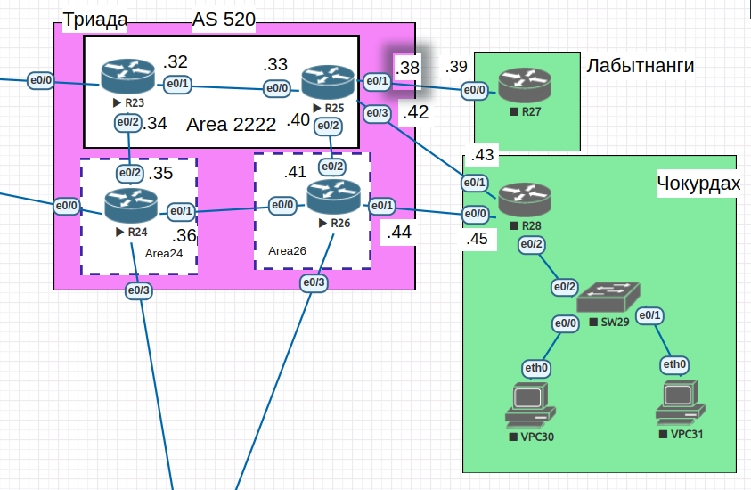

#  IS-IS

## Цель

 - Настроить IS-IS офисе Триада

##  Задание:

 1. Настроите IS-IS в ISP Триада.
 2. R23 и R25 находятся в зоне 2222.
 3. R24 находится в зоне 24.
 4. R26 находится в зоне 26.

### 1. Общие положения.

 - В работе за основу взята лабораторная работа 6.
 - Участвуют роутеры провайдера Триада и сети Чокурдах + Лабытнанги.
 - Статические маршруты на Триаде отсутствуют.

#### 1.2 Схема сети



#### 1.3 Таблица адресации


| Device        | Interface     | IP address      | Subnet mask     | Default gateway |
| ------------- | ------------- | --------------- | --------------- | --------------- |
| R23           | e0/0          | 10.0.0.31       | 255.255.255.254 | N/A             |
|               | e0/1          | 10.0.0.32       | 255.255.255.254 | N/A             |
|               | e0/2          | 10.0.0.34       | 255.255.255.254 | N/A             |
| R24           | e0/0          | 10.0.0.29       | 255.255.255.254 | N/A             |
|               | e0/1          | 10.0.0.36       | 255.255.255.254 | N/A             |
|               | e0/2          | 10.0.0.35       | 255.255.255.254 | N/A             |
|               | e0/3          | 10.0.0.23       | 255.255.255.254 | N/A             |
| R25           | e0/0          | 10.0.0.33       | 255.255.255.254 | N/A             |
|               | e0/1          | 10.0.0.38       | 255.255.255.254 | N/A             |
|               | e0/2          | 10.0.0.40       | 255.255.255.254 | N/A             |
|               | e0/3          | 10.0.0.42       | 255.255.255.254 | N/A             |
| R26           | e0/0          | 10.0.0.37       | 255.255.255.254 | N/A             |
|               | e0/1          | 10.0.0.44       | 255.255.255.254 | N/A             |
|               | e0/2          | 10.0.0.41       | 255.255.255.254 | N/A             |
|               | e0/3          | 10.0.0.25       | 255.255.255.254 | N/A             |
| R27           | e0/0          | 10.0.0.39       | 255.255.255.254 | N/A             |
| R28           | e0/0          | 10.0.0.45       | 255.255.255.254 | N/A             |
|               | e0/1          | 10.0.0.43       | 255.255.255.254 | N/A             |
|               | e0/2.10       | 192.168.102.1   | 255.255.255.128 | N/A             |
|               | e0/2.20       | 192.168.102.129 | 255.255.255.128 | N/A             |
|               | e0/2.40       | 172.16.102.1    | 255.255.255.0   | N/A             |
| SW29          | VLAN40        | 172.16.102.10   | 255.255.255.0   | 172.16.102.1    |
| VPC30         | e0/0          | 192.168.102.10  | 255.255.255.128 | 192.168.102.1   |
| VPC31         | e0/0          | 192.168.102.139 | 255.255.255.128 | 192.168.102.129 |

### 2. Настройка IS-IS.
#### 2.1 Настройка R23 и R25  в зоне 2222.

- Настраиваю параметр net.
```
R23(config)#router isis
R23(config-router)#net 49.2222.0000.0000.0023.00
```
 - Включаю маршрутизацию на интерфейсах e0/1-2
```
R23(config)#interface range e0/1-2
R23(config-if-range)#ip router isis
```
- Настройка R25 в той же зоне.
```
R25(config)#router isis
R25(config-router)#net 49.2222.0000.0000.0025.00
R25(config-router)#exit
R25(config)#interface range e0/0,e0/2
R25(config-if-range)#ip router isis
```
- Проверка соседства.
```
R23#show isis neighbors

System Id      Type Interface   IP Address      State Holdtime Circuit Id
R25            L1   Et0/1       10.0.0.33       UP    9        R25.01             
R25            L2   Et0/1       10.0.0.33       UP    7        R25.01
...
R25#show isis neighbors

System Id      Type Interface   IP Address      State Holdtime Circuit Id
R23            L1   Et0/0       10.0.0.32       UP    29       R25.01             
R23            L2   Et0/0       10.0.0.32       UP    21       R25.01
```
 - R23 и R25 установили отношения соседства и R25 стал DIS.


#### 2.2 R24 и R26.

 - Настраиваю R24.
```
R24(config)#router isis
R24(config-router)#net 49.0024.0000.0000.0024.00
R24(config-router)#exit
R24(config)#interface range e0/1-2
R24(config-if-range)#ip router isis
```
 - И R26.
```
R26(config-router)#net 49.0026.0000.0000.0026.00
R26(config-router)#exit
R26(config)#interface range e0/0,e0/2
R26(config-if-range)#ip router isis
```
 - Проверяю соседство.
```
R24#show isis neighbors

System Id      Type Interface   IP Address      State Holdtime Circuit Id
R23            L2   Et0/2       10.0.0.34       UP    26       R24.02             
R26            L2   Et0/1       10.0.0.37       UP    8        R26.01
...
R26#show isis neighbors

System Id      Type Interface   IP Address      State Holdtime Circuit Id
R24            L2   Et0/0       10.0.0.36       UP    29       R26.01             
R25            L2   Et0/2       10.0.0.40       UP    23       R26.02    

```
#### 2.3 Проверка.
