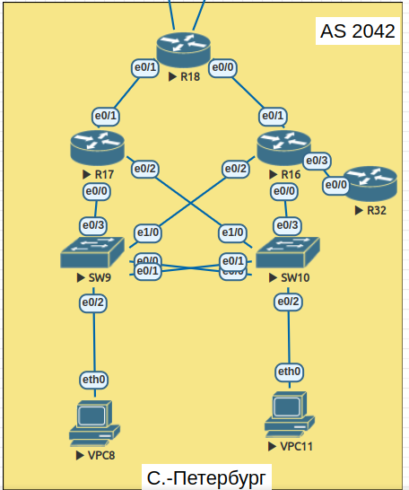

#  EIGRP

## Цель

 - Настроить named EIGRP в С.-Петербург;

##  Задание:

 1. В офисе С.-Петербург настроить EIGRP.
 2. R32 получает только маршрут по умолчанию.
 3. R16-17 анонсируют только суммарные префиксы.
 4. Использовать EIGRP named-mode для настройки сети.

### 1. Общие положения.

#### 1.1 Схема сети



#### 1.2 Таблица адресации


| Device        | Interface     | IP address      | Network/Netmask    | Default gateway |
| ------------- | ------------- | --------------- | ------------------ | --------------- |
| VPC8          | e0/0          | DHCP            | 192.168.101.0/25   | 192.168.101.1   |
| SW9           | VLAN40        | 172.16.101.10   | 172.16.101.0/24    | 172.16.101.1    |
| SW10          | VLAN40        | 172.16.101.11   | 172.16.101.0/24    | 172.16.101.1    |
| VPC11         | e0/0          | DHCP            | 192.168.101.128/25 | 192.168.101.129 |
| R16           | vlan10        | 192.168.101.2   | 192.168.101.0/25   | N/A             |
|               | vlan20        | 192.168.101.130 | 255.255.255.128    | N/A             |
|               | vlan40        | 172.16.101.2    | 172.16.101.0/24    | N/A             |
|               | e0/1          | 10.0.0.16       | 255.255.255.254    | N/A             |
|               | e0/3          | 10.0.0.18       | 255.255.255.254    | N/A             |
| R17           | vlan10        | 192.168.101.3   | 192.168.101.0/25   | N/A             |
|               | vlan20        | 192.168.101.131 | 192.168.101.128/25 | N/A             |
|               | vlan40        | 172.16.101.3    | 172.16.101.0/24    | N/A             |
|               | e0/1          | 10.0.0.20       | 255.255.255.254    | N/A             |
| R18           | e0/0          | 10.0.0.17       | 255.255.255.254    | N/A             |
|               | e0/1          | 10.0.0.21       | 255.255.255.254    | N/A             |
|               | e0/2          | 10.0.0.22       | 255.255.255.254    | N/A             |
|               | e0/3          | 10.0.0.24       | 255.255.255.254    | N/A             |
| R32           | e0/0          | 10.0.0.19       | 255.255.255.254    | N/A             |

### 2. Настройка EIGRP.
#### 2.1 Настройка named-mode EIGRP на R16-R18.

- Настраиваю R16.
```
R17(config)#router eigrp SPB
R17(config-router)#address-family ipv4 unicast autonomous-system 1
R17(config-router-af)#eigrp router-id 10.0.0.20
R17(config-router-af)#network 10.0.0.0
R17(config-router-af)#no shutdown
R17(config-router-af)#exit-address-family
R17(config-router)#no shutdown
```
 - R17 и R18 настраиваю аналогично, в качестве router-id использую максимальный ip в сети 10.0.0.0.
 - Проверяю состояние соседства.
```
R16(config)#do show eigrp address-family ipv4 neighbors
EIGRP-IPv4 VR(SPB) Address-Family Neighbors for AS(1)
H   Address                 Interface              Hold Uptime   SRTT   RTO  Q  Seq
                                                   (sec)         (ms)       Cnt Num
0   10.0.0.17               Et0/1                    10 00:02:40    2   100  0  6

R17(config)#do show eigrp address-family ipv4 neighbors
EIGRP-IPv4 VR(SPB) Address-Family Neighbors for AS(1)
H   Address                 Interface              Hold Uptime   SRTT   RTO  Q  Seq
                                                   (sec)         (ms)       Cnt Num
0   10.0.0.21               Et0/1                    10 00:03:10    9   100  0  5

R18(config)#do show eigrp address-family ipv4 neighbors
EIGRP-IPv4 VR(SPB) Address-Family Neighbors for AS(1)
H   Address                 Interface              Hold Uptime   SRTT   RTO  Q  Seq
                                                   (sec)         (ms)       Cnt Num
1   10.0.0.20               Et0/1                    14 00:01:55    9   100  0  4
0   10.0.0.16               Et0/0                    12 00:01:55 1599  5000  0  3

```
 - На R16 и R17 включаю редистрибуцию подключенных сетей и автосуммаризацию.
 ```
 R16(config)#router eigrp SPB
 R16(config-router)#address-family ipv4 unicast autonomous-system 1
 R16(config-router-af)#topology base
 R16(config-router-af-topology)#redistribute connected
 R16(config-router-af-topology)#auto-summary
 ```
 - Проверяю на R18
 ```
 R18#show ip route eigrp
 ...
 Gateway of last resort is not set

       10.0.0.0/8 is variably subnetted, 9 subnets, 2 masks
 D        10.0.0.18/31 [90/1536000] via 10.0.0.16, 2d03h, Ethernet0/0
       172.16.0.0/24 is subnetted, 1 subnets
 D EX     172.16.101.0 [170/1029120] via 10.0.0.20, 00:00:30, Ethernet0/1
                       [170/1029120] via 10.0.0.16, 00:00:30, Ethernet0/0
       192.168.101.0/25 is subnetted, 2 subnets
 D EX     192.168.101.0 [170/1029120] via 10.0.0.20, 00:00:30, Ethernet0/1
                        [170/1029120] via 10.0.0.16, 00:00:30, Ethernet0/0
 D EX     192.168.101.128 [170/1029120] via 10.0.0.20, 00:00:30, Ethernet0/1
                          [170/1029120] via 10.0.0.16, 00:00:30, Ethernet0/0
 ```
 - Адрес не суммаризировался, остались сети 25. Указываю summary-address на R16 и R17
 ```
 R16(config-router-af)#af-interface e0/1
 R16(config-router-af-interface)#summary-address 192.168.101.0 255.255.255.0
 ```
 - Проверяю
 ```
 R18#show ip route eigrp

...

Gateway of last resort is not set

      10.0.0.0/8 is variably subnetted, 9 subnets, 2 masks
D        10.0.0.18/31 [90/1536000] via 10.0.0.16, 2d03h, Ethernet0/0
      172.16.0.0/24 is subnetted, 1 subnets
D EX     172.16.101.0 [170/1029120] via 10.0.0.20, 00:07:54, Ethernet0/1
                      [170/1029120] via 10.0.0.16, 00:07:54, Ethernet0/0
D     192.168.101.0/24 [90/1029120] via 10.0.0.20, 00:00:07, Ethernet0/1
                       [90/1029120] via 10.0.0.16, 00:00:07, Ethernet0/0
 ```
#### 2.2 Настройка R32.

 - Настраиваю EIGRP.
```
R32(config)#router eigrp SPB
  R32(config-router)#address-family  ipv4 unicast autonomous-system 1
R32(config-router-af)#eigrp router-id 10.0.0.19
R32(config-router-af)#network 10.0.0.0
R32(config-router-af)#no shutdown
R32(config-router-af)#exit-address-family
R32(config-router)#no shutdown
```
 - Проверяю соседей и маршрут.
 ```
 R32(config-router)#do show eigrp address-family ipv4 neighbors
EIGRP-IPv4 VR(SPB) Address-Family Neighbors for AS(1)
H   Address                 Interface              Hold Uptime   SRTT   RTO  Q  Seq
                                                   (sec)         (ms)       Cnt Num
0   10.0.0.18               Et0/0                    12 00:02:43   14   100  0  12

R32(config-router)#exit          
R32(config)#do show ip route eigrp

...

Gateway of last resort is not set

      10.0.0.0/8 is variably subnetted, 6 subnets, 2 masks
D        10.0.0.16/31 [90/1536000] via 10.0.0.18, 00:03:36, Ethernet0/0
D        10.0.0.20/31 [90/2048000] via 10.0.0.18, 00:03:36, Ethernet0/0
D        10.0.0.22/31 [90/2048000] via 10.0.0.18, 00:03:36, Ethernet0/0
D        10.0.0.24/31 [90/2048000] via 10.0.0.18, 00:03:36, Ethernet0/0
      172.16.0.0/24 is subnetted, 1 subnets
D EX     172.16.101.0 [170/1029120] via 10.0.0.18, 00:03:36, Ethernet0/0
      192.168.101.0/25 is subnetted, 2 subnets
D EX     192.168.101.0 [170/1029120] via 10.0.0.18, 00:03:36, Ethernet0/0
D EX     192.168.101.128 [170/1029120] via 10.0.0.18, 00:03:36, Ethernet0/0
 ```
 - Настраиваю суммаризацию маршрута по-умолчанию.
 ```
R16(config-router-af)#af-interface e0/3
R16(config-router-af-interface)#summary-address 0.0.0.0 0.0.0.0
 ```

 - Проверяю.
 ```
 R32(config)#do show ip route eigrp

...

Gateway of last resort is 10.0.0.18 to network 0.0.0.0

D*    0.0.0.0/0 [90/1029120] via 10.0.0.18, 00:00:11, Ethernet0/0


R32#ping 192.168.101.139
Type escape sequence to abort.
Sending 5, 100-byte ICMP Echos to 192.168.101.139, timeout is 2 seconds:
!!!!!
Success rate is 100 percent (5/5), round-trip min/avg/max = 1/2/5 ms

 ```
