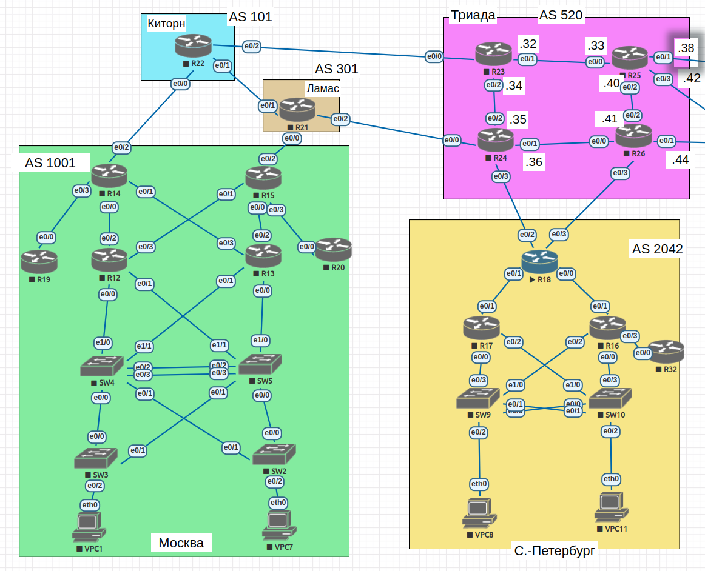

#  iBGP

## Цель

- Настроить iBGP в офисе Москва
- Настроить iBGP в сети провайдера Триада
- Организовать полную IP связанность всех сетей

##  Задание:

1. Настроите iBGP в офисом Москва между маршрутизаторами R14 и R15.
2. Настроите iBGP в провайдере Триада, с использованием RR.
3. Настройте офис Москва так, чтобы приоритетным провайдером стал Ламас.
4. Настройте офиса С.-Петербург так, чтобы трафик до любого офиса распределялся по двум линкам одновременно.
5. Все сети в лабораторной работе должны иметь IP связность.
6. План работы и изменения зафиксированы в документации.

### 1. Общие положения.

#### 1.1 Схема сети



#### 1.2 Таблица адресации


| Device        | Interface     | IP address      | Subnet mask     | Default gateway |
| ------------- | ------------- | --------------- | --------------- | --------------- |
| R14           | e0/0          | 10.0.0.1        | 255.255.255.254 | N/A             |
|               | e0/1          | 10.0.0.7        | 255.255.255.254 | N/A             |
|               | e0/2          | 10.0.0.8        | 255.255.255.254 | N/A             |
|               | e0/3          | 10.0.0.10       | 255.255.255.254 | N/A             |
|               | e1/0          | 10.0.0.46       | 255.255.255.254 | N/A             |
|               | lo1           | 10.1.0.14       | 255.255.255.255 | N/A             |
| R15           | e0/0          | 10.0.0.5        | 255.255.255.254 | N/A             |
|               | e0/1          | 10.0.0.3        | 255.255.255.254 | N/A             |
|               | e0/2          | 10.0.0.12       | 255.255.255.254 | N/A             |
|               | e0/3          | 10.0.0.14       | 255.255.255.254 | N/A             |
|               | e1/0          | 10.0.0.47       | 255.255.255.254 | N/A             |
|               | lo1           | 10.1.0.15       | 255.255.255.255 | N/A             |
| R18           | e0/0          | 10.0.0.17       | 255.255.255.254 | N/A             |
|               | e0/1          | 10.0.0.21       | 255.255.255.254 | N/A             |
|               | e0/2          | 10.0.0.22       | 255.255.255.254 | N/A             |
|               | e0/3          | 10.0.0.24       | 255.255.255.254 | N/A             |
|               | lo1           | 10.1.0.18       | 255.255.255.255 | N/A             |
| R19           | e0/0          | 10.0.0.11       | 255.255.255.254 | N/A             |
| R20           | e0/0          | 10.0.0.15       | 255.255.255.254 | N/A             |
| R21           | e0/0          | 10.0.0.13       | 255.255.255.254 | N/A             |
|               | e0/1          | 10.0.0.26       | 255.255.255.254 | N/A             |
|               | e0/2          | 10.0.0.28       | 255.255.255.254 | N/A             |
|               | lo1           | 10.1.0.21       | 255.255.255.255 | N/A             |
| R22           | e0/0          | 10.0.0.9        | 255.255.255.254 | N/A             |
|               | e0/1          | 10.0.0.27       | 255.255.255.254 | N/A             |
|               | e0/2          | 10.0.0.30       | 255.255.255.254 | N/A             |
|               | lo1           | 10.1.0.22       | 255.255.255.255 | N/A             |
| R23           | e0/0          | 10.0.0.31       | 255.255.255.254 | N/A             |
|               | e0/1          | 10.0.0.32       | 255.255.255.254 | N/A             |
|               | e0/2          | 10.0.0.34       | 255.255.255.254 | N/A             |
|               | lo1           | 10.1.0.23       | 255.255.255.255 | N/A             |
| R24           | e0/0          | 10.0.0.29       | 255.255.255.254 | N/A             |
|               | e0/1          | 10.0.0.36       | 255.255.255.254 | N/A             |
|               | e0/2          | 10.0.0.35       | 255.255.255.254 | N/A             |
|               | e0/3          | 10.0.0.23       | 255.255.255.254 | N/A             |
|               | lo1           | 10.1.0.24       | 255.255.255.255 | N/A             |
| R25           | e0/0          | 10.0.0.33       | 255.255.255.254 | N/A             |
|               | e0/1          | 10.0.0.38       | 255.255.255.254 | N/A             |
|               | e0/2          | 10.0.0.40       | 255.255.255.254 | N/A             |
|               | e0/3          | 10.0.0.42       | 255.255.255.254 | N/A             |
|               | lo1           | 10.1.0.25       | 255.255.255.255 | N/A             |
| R26           | e0/0          | 10.0.0.37       | 255.255.255.254 | N/A             |
|               | e0/1          | 10.0.0.44       | 255.255.255.254 | N/A             |
|               | e0/2          | 10.0.0.41       | 255.255.255.254 | N/A             |
|               | e0/3          | 10.0.0.25       | 255.255.255.254 | N/A             |
|               | lo1           | 10.1.0.26       | 255.255.255.255 | N/A             |

#### 1.3 Настройка Loopback-интерфейсов.
- Для отказоустойчивости сети создаю loopback-интерфейсы согласно таблице 1.2.
- Интерфейсы Looplack 1 на R14 и R15 помещаю в ospf.
```
interface Loopback1
 ip address 10.1.0.14 255.255.255.255
 ip ospf 1 area 10

```
- Интерфейсы Looplack 1 на роутерах Триады добавляю в Is-Is.
```
interface Loopback1
 ip address 10.1.0.24 255.255.255.255
 ip router isis

```

### 2. Настройка iBGP.
#### 2.1 Настройка iBGP в офисом Москва между маршрутизаторами R14 и R15.
 - За основу взята конфигурация роутеров из lab07, в которой добавлялся дополнительный линк между данными роутерами для создания Area0 и во всем домене работал OSPF.
 - Дальше подымается сессия iBGP между адресами интерфейсов E1/0.
 - Настройка R14.
```
R14(config)#router bgp 1001
R14(config-router)#neighbor 10.1.0.15 remote-as 1001
R14(config-router)#neighbor 10.1.0.15 update-source Loopback1

```
 - Настройка R15
```
R15(config)#router bgp 1001
R15(config-router)#neighbor 10.1.0.14 remote-as 1001
R15(config-router)#neighbor 10.1.0.14 update-source Loopback1
```

 - Проверка, сосед виден.
 ```
 R14#show ip bgp summary
 BGP router identifier 10.0.0.46, local AS number 1001
 BGP table version is 72, main routing table version 72
 30 network entries using 4200 bytes of memory
 50 path entries using 4000 bytes of memory
 12/8 BGP path/bestpath attribute entries using 1728 bytes of memory
 7 BGP AS-PATH entries using 168 bytes of memory
 0 BGP route-map cache entries using 0 bytes of memory
 0 BGP filter-list cache entries using 0 bytes of memory
 BGP using 10096 total bytes of memory
 BGP activity 36/6 prefixes, 99/49 paths, scan interval 60 secs

Neighbor        V           AS MsgRcvd MsgSent   TblVer  InQ OutQ Up/Down  State/PfxRcd
10.0.0.9        4          101     179     182       72    0    0 02:27:59       21
10.1.0.15       4         1001     149     149       72    0    0 02:04:15       23

R15(config)#do show ip bgp summary
BGP router identifier 10.0.0.47, local AS number 1001
BGP table version is 55, main routing table version 55
30 network entries using 4200 bytes of memory
49 path entries using 3920 bytes of memory
12/8 BGP path/bestpath attribute entries using 1728 bytes of memory
7 BGP AS-PATH entries using 168 bytes of memory
0 BGP route-map cache entries using 0 bytes of memory
0 BGP filter-list cache entries using 0 bytes of memory
BGP using 10016 total bytes of memory
BGP activity 34/4 prefixes, 83/34 paths, scan interval 60 secs

Neighbor        V           AS MsgRcvd MsgSent   TblVer  InQ OutQ Up/Down  State/PfxRcd
10.0.0.13       4          301   17541   17513       55    0    0 1w4d           20
10.1.0.14       4         1001      15      14       55    0    0 00:02:25       23

 ```

#### 2.2 Настройка iBGP в провайдере Триада, с использованием RR.

- Настраиваю соседство роутеров и R24.
```
R23#show running-config | sect bgp
router bgp 520
 bgp log-neighbor-changes
 redistribute connected
 neighbor 10.0.0.30 remote-as 101
 neighbor 10.0.0.30 update-source Loopback1
 neighbor 10.1.0.24 remote-as 520
 neighbor 10.1.0.24 update-source Loopback1

R25#show running-config | sect bgp
router bgp 520
 bgp log-neighbor-changes
 network 10.0.0.39
 redistribute connected
 neighbor 10.1.0.24 remote-as 520
 neighbor 10.1.0.24 update-source Loopback1

R26#show running-config | sect bgp
router bgp 520
 bgp log-neighbor-changes
 network 192.168.102.0
 redistribute connected
 neighbor 10.0.0.24 remote-as 2042
 neighbor 10.1.0.24 remote-as 520
 neighbor 10.1.0.24 update-source Loopback1

```
- На R24 настраиваю route-reflector.
```
R24#show running-config | sect bgp
router bgp 520
 bgp log-neighbor-changes
 network 10.0.0.30 mask 255.255.255.254
 redistribute connected
 neighbor as520 peer-group
 neighbor as520 remote-as 520
 neighbor as520 update-source Loopback1
 neighbor as520 route-reflector-client
 neighbor 10.0.0.22 remote-as 2042
 neighbor 10.0.0.28 remote-as 301
 neighbor 10.1.0.23 peer-group as520
 neighbor 10.1.0.25 peer-group as520
 neighbor 10.1.0.26 peer-group as520

```

```
- Проверка
```
R24#show ip bgp summary
BGP router identifier 10.1.0.24, local AS number 520
BGP table version is 100, main routing table version 100
30 network entries using 4200 bytes of memory
49 path entries using 3920 bytes of memory
13/8 BGP path/bestpath attribute entries using 1872 bytes of memory
6 BGP AS-PATH entries using 144 bytes of memory
0 BGP route-map cache entries using 0 bytes of memory
0 BGP filter-list cache entries using 0 bytes of memory
BGP using 10136 total bytes of memory
BGP activity 37/7 prefixes, 124/75 paths, scan interval 60 secs

Neighbor        V           AS MsgRcvd MsgSent   TblVer  InQ OutQ Up/Down  State/PfxRcd
10.0.0.22       4         2042      31      39      100    0    0 00:22:58        5
10.0.0.28       4          301      57      56      100    0    0 00:39:47       15
10.1.0.23       4          520    2644    2673      100    0    0 1d15h          13
10.1.0.25       4          520   20303   20333      100    0    0 1w5d            5
10.1.0.26       4          520      52      65      100    0    0 00:43:25        5


```

#### 2.3 Настройте офис Москва так, чтобы приоритетным провайдером стал Ламас.
 - Проверим как идет пинг до R18 с R14 и R15.
 ```
 R14#traceroute 10.0.0.22
 Type escape sequence to abort.
 Tracing the route to 10.0.0.22
 VRF info: (vrf in name/id, vrf out name/id)
   1 10.0.0.9 1 msec 1 msec 0 msec
   2 10.0.0.31 [AS 101] 1 msec 1 msec 1 msec
   3 10.0.0.35 2 msec 3 msec 1 msec
   4 10.0.0.22 [AS 2042] 2 msec 3 msec *

 R15#traceroute 10.0.0.22
 Type escape sequence to abort.
 Tracing the route to 10.0.0.22
 VRF info: (vrf in name/id, vrf out name/id)
   1 10.0.0.13 4 msec 1 msec 1 msec
   2 10.0.0.29 [AS 301] 1 msec 2 msec 1 msec
   3 10.0.0.22 [AS 2042] 1 msec 1 msec *
 ```
 - Один идет через Киторн, другой через Ламас.

 - Создадим route-map с local-preference и применим его на соседа R22
 ```
R14(config)#route-map ebgp_in permit 20
R14(config-route-map)#set local-preference 200

R14(config-router)#neighbor 10.0.0.9 route-map ebgp_in in

 ```

 - Смотрим таблицу bgp.
 ```
 R14#show ip bgp                  
 BGP table version is 47, local router ID is 10.0.0.10
 Status codes: s suppressed, d damped, h history, * valid, > best, i - internal,
               r RIB-failure, S Stale, m multipath, b backup-path, f RT-Filter,
               x best-external, a additional-path, c RIB-compressed,
 Origin codes: i - IGP, e - EGP, ? - incomplete
 RPKI validation codes: V valid, I invalid, N Not found

      Network          Next Hop            Metric LocPrf Weight Path
  *>  10.0.0.0/31      0.0.0.0                  0         32768 ?
  r>i 10.0.0.2/31      10.0.0.47                0    100      0 ?
  r>i 10.0.0.4/31      10.0.0.47                0    100      0 ?
  *>  10.0.0.6/31      0.0.0.0                  0         32768 ?
  *   10.0.0.8/31      10.0.0.9                 0    200      0 101 ?
  *>                   0.0.0.0                  0         32768 i
  *>  10.0.0.10/31     0.0.0.0                  0         32768 ?
  * i 10.0.0.12/31     10.0.0.47                0    100      0 ?
  *>                   10.0.0.9                      200      0 101 301 ?
  r>i 10.0.0.14/31     10.0.0.47                0    100      0 ?
  *>  10.0.0.22/31     10.0.0.9                      200      0 101 520 2042 i
  *>  10.0.0.26/31     10.0.0.9                 0    200      0 101 ?
  *>  10.0.0.28/31     10.0.0.9                      200      0 101 301 ?
  *>  10.0.0.30/31     10.0.0.9                 0    200      0 101 ?
      Network          Next Hop            Metric LocPrf Weight Path
  *>  10.0.0.32/31     10.0.0.9                      200      0 101 520 ?
  *>  10.0.0.38/31     10.0.0.9                      200      0 101 520 ?
  *>  10.0.0.40/31     10.0.0.9                      200      0 101 520 ?
  *>  10.0.0.42/31     10.0.0.9                      200      0 101 520 ?
  * i 10.0.0.46/31     10.0.0.47                0    100      0 ?
  *>                   0.0.0.0                  0         32768 ?
  *>  10.1.0.25/32     10.0.0.9                      200      0 101 520 ?

 ```

 - Появился LocPrf 200. Попробую пропинговать.
 ```
 R14#traceroute 10.0.0.22
 Type escape sequence to abort.
 Tracing the route to 10.0.0.22
 VRF info: (vrf in name/id, vrf out name/id)
   1 10.0.0.9 0 msec 1 msec 0 msec
   2 10.0.0.31 [AS 101] 2 msec 1 msec 1 msec
   3 10.0.0.35 2 msec 2 msec 2 msec
   4 10.0.0.22 [AS 2042] 2 msec 3 msec *

 R15#traceroute 10.0.0.22
 Type escape sequence to abort.
 Tracing the route to 10.0.0.22
 VRF info: (vrf in name/id, vrf out name/id)
   1 10.0.0.46 1 msec 1 msec 0 msec
   2 10.0.0.9 1 msec 2 msec 1 msec
   3 10.0.0.31 [AS 101] 1 msec 1 msec 1 msec
   4 10.0.0.35 2 msec 2 msec 1 msec
   5 10.0.0.22 [AS 2042] 2 msec 3 msec *

 R19>traceroute 10.0.0.22
 Type escape sequence to abort.
 Tracing the route to 10.0.0.22
 VRF info: (vrf in name/id, vrf out name/id)
   1 10.0.0.10 1 msec 1 msec 0 msec
   2 10.0.0.9 1 msec 1 msec 1 msec
   3 10.0.0.31 1 msec 2 msec 1 msec
   4 10.0.0.35 2 msec 3 msec 1 msec
   5 10.0.0.22 2 msec 3 msec *
 ```
- Всё идет околицей через Киторн, а надо было наоборот. Потому как local-preference чем больше - тем путь лучше. Поменяю и проверю вновь.
```
R14(config)#route-map ebgp_in permit 20
R14(config-route-map)#set local-preference 50

R14#trace 10.0.0.22
Type escape sequence to abort.
Tracing the route to 10.0.0.22
VRF info: (vrf in name/id, vrf out name/id)
  1 10.0.0.47 0 msec 1 msec 0 msec
  2 10.0.0.13 1 msec 2 msec 1 msec
  3 10.0.0.29 [AS 301] 2 msec 1 msec 1 msec
  4 10.0.0.22 [AS 2042] 2 msec 3 msec *

R15#traceroute 10.0.0.22
Type escape sequence to abort.
Tracing the route to 10.0.0.22
VRF info: (vrf in name/id, vrf out name/id)
  1 10.0.0.13 0 msec 0 msec 1 msec
  2 10.0.0.29 [AS 301] 1 msec 1 msec 1 msec
  3 10.0.0.22 [AS 2042] 2 msec 2 msec *

R19>traceroute 10.0.0.22
Type escape sequence to abort.
Tracing the route to 10.0.0.22
VRF info: (vrf in name/id, vrf out name/id)
  1 10.0.0.10 1 msec 1 msec 1 msec
  2 10.0.0.47 1 msec 2 msec 1 msec
  3 10.0.0.13 2 msec 2 msec 1 msec
  4 10.0.0.29 2 msec 3 msec 2 msec
  5 10.0.0.22 2 msec 3 msec *

```
 - Теперь идет правильно.
 - Проверяю входящий трафик.
```
R18>traceroute 10.0.0.11
Type escape sequence to abort.
Tracing the route to 10.0.0.11
VRF info: (vrf in name/id, vrf out name/id)
  1 10.0.0.23 1 msec 1 msec 1 msec
  2 10.0.0.28 [AS 301] 1 msec 2 msec 1 msec
  3 10.0.0.12 [AS 301] 1 msec 2 msec 1 msec
  4 10.0.0.46 [AS 1001] 2 msec 2 msec 1 msec
  5 10.0.0.11 [AS 1001] 3 msec 2 msec *

R27#traceroute 10.0.0.11
Type escape sequence to abort.
Tracing the route to 10.0.0.11
VRF info: (vrf in name/id, vrf out name/id)
  1 10.0.0.38 0 msec 1 msec 1 msec
  2 10.0.0.32 2 msec 1 msec 1 msec
  3 10.0.0.30 1 msec 2 msec 2 msec
  4 10.0.0.8 3 msec 2 msec 1 msec
  5 10.0.0.11 3 msec 4 msec *
```
 - Один идет через Ламас, второй через Киторн. Чтобы все шло по одному пути, применяю AS-Path prepend на R14.
 ```
 R14(config)#route-map ebgp_out permit 20
 R14(config-route-map)#set as-path prepend 1001 1001 1001
 R14(config-route-map)#exit
 R14(config)#router bgp 1001
 R14(config-router)#neighbor 10.0.0.9 route-map ebgp_out out

 R22#show ip bgp | include 10.0.0.8
  *                    10.0.0.8                 0             0 1001 1001 1001 1001 ?
  *                    10.0.0.8                               0 1001 1001 1001 1001 ?
  *                    10.0.0.8                               0 1001 1001 1001 1001 ?
  *                    10.0.0.8                 0             0 1001 1001 1001 1001 ?
  *>  10.0.0.8/31      0.0.0.0                  0         32768 ?
  *                    10.0.0.8                 0             0 1001 1001 1001 1001 i
  *                    10.0.0.8                 0             0 1001 1001 1001 1001 ?
  *   10.0.0.12/31     10.0.0.8                               0 1001 1001 1001 1001 ?
  *                    10.0.0.8                               0 1001 1001 1001 1001 ?
  *   10.0.0.22/31     10.0.0.8                               0 1001 1001 1001 1001 301 520 2042 i
  *   10.0.0.26/31     10.0.0.8                               0 1001 1001 1001 1001 301 ?
  *   10.0.0.28/31     10.0.0.8                               0 1001 1001 1001 1001 301 ?
  *   10.0.0.32/31     10.0.0.8                               0 1001 1001 1001 1001 301 520 ?
  *   10.0.0.38/31     10.0.0.8                               0 1001 1001 1001 1001 301 520 ?
  *   10.0.0.40/31     10.0.0.8                               0 1001 1001 1001 1001 301 520 ?
  *   10.0.0.42/31     10.0.0.8                               0 1001 1001 1001 1001 301 520 ?
  *                    10.0.0.8                 0             0 1001 1001 1001 1001 ?
  *   10.1.0.25/32     10.0.0.8                               0 1001 1001 1001 1001 301 520 ?

 ```
 - Path поменялся. Проверяю пути.
 ```
R18>traceroute 10.0.0.11
Type escape sequence to abort.
Tracing the route to 10.0.0.11
VRF info: (vrf in name/id, vrf out name/id)
  1 10.0.0.23 1 msec 1 msec 1 msec
  2 10.0.0.28 [AS 301] 1 msec 2 msec 0 msec
  3 10.0.0.12 [AS 301] 2 msec 2 msec 1 msec
  4 10.0.0.46 [AS 1001] 2 msec 3 msec 1 msec
  5 10.0.0.11 [AS 1001] 2 msec 2 msec *

R27>traceroute 10.0.0.11
Type escape sequence to abort.
Tracing the route to 10.0.0.11
VRF info: (vrf in name/id, vrf out name/id)
  1 10.0.0.38 1 msec 1 msec 0 msec
  2 10.0.0.32 1 msec 1 msec 1 msec
  3 10.0.0.35 1 msec 2 msec 1 msec
  4 10.0.0.28 2 msec 2 msec 2 msec
  5 10.0.0.12 5 msec 3 msec 1 msec
  6 10.0.0.46 2 msec 4 msec 2 msec
  7 10.0.0.11 3 msec 4 msec *

 ```
- От R18 путь не поменялся, а R27 стал заходить челез Ламас. Что и требовалось.
- Попробую отключить линк R21-R15 и проверю резервность канала.
```
R19>traceroute 10.0.0.22
Type escape sequence to abort.
Tracing the route to 10.0.0.22
VRF info: (vrf in name/id, vrf out name/id)
  1 10.0.0.10 1 msec 1 msec 0 msec
  2 10.0.0.47 1 msec 2 msec 1 msec
  3  *  *  *
  4  *  *  *
  5  *  *  *
  6  *  *  *
  7  *  *  *
  8  *  *  *
  9  *  *  *
 10  *  *  *
 11 10.0.0.22 2 msec 3 msec *
R19>traceroute 10.0.0.22
Type escape sequence to abort.
Tracing the route to 10.0.0.22
VRF info: (vrf in name/id, vrf out name/id)
  1 10.0.0.10 0 msec 0 msec 1 msec
  2 10.0.0.9 1 msec 2 msec 1 msec
  3 10.0.0.31 2 msec 2 msec 2 msec
  4 10.0.0.35 3 msec 2 msec 1 msec
  5 10.0.0.22 2 msec 3 msec *

R18>traceroute 10.0.0.11
Type escape sequence to abort.
Tracing the route to 10.0.0.11
VRF info: (vrf in name/id, vrf out name/id)
  1 10.0.0.23 1 msec 1 msec 0 msec
  2 10.0.0.28 [AS 301] 1 msec 2 msec 0 msec
  3 10.0.0.27 [AS 301] 2 msec 2 msec 1 msec
  4 10.0.0.8 [AS 101] 1 msec 2 msec 2 msec
  5 10.0.0.11 [AS 1001] 2 msec 3 msec *

R27>traceroute 10.0.0.11
Type escape sequence to abort.
Tracing the route to 10.0.0.11
VRF info: (vrf in name/id, vrf out name/id)
  1 10.0.0.38 1 msec 1 msec 0 msec
  2 10.0.0.32 1 msec 1 msec 1 msec
  3 10.0.0.30 2 msec 2 msec 1 msec
  4 10.0.0.8 2 msec 2 msec 2 msec
  5 10.0.0.11 2 msec 3 msec *
```
 - Не сразу, но пошли через AS 101.
 - Включаю линк обратно, проверяю.
```
R27>traceroute 10.0.0.11
Type escape sequence to abort.
Tracing the route to 10.0.0.11
VRF info: (vrf in name/id, vrf out name/id)
  1 10.0.0.38 1 msec 13 msec 1 msec
  2 10.0.0.32 1 msec 1 msec 1 msec
  3 10.0.0.35 1 msec 2 msec 2 msec
  4 10.0.0.28 1 msec 2 msec 2 msec
  5 10.0.0.12 2 msec 2 msec 2 msec
  6 10.0.0.46 2 msec 2 msec 2 msec
  7 10.0.0.11 2 msec 2 msec *

```
 - Возобновился основной маршрут.

#### 2.4. Настройте офиса С.-Петербург так, чтобы трафик до любого офиса распределялся по двум линкам одновременно.
- Для этого используется параметр maximum-paths
```
R18(config-router)#maximum-paths 2
```
- Проверка.
```
R18#traceroute 10.0.0.32
Type escape sequence to abort.
Tracing the route to 10.0.0.32
VRF info: (vrf in name/id, vrf out name/id)
  1 10.0.0.23 1 msec
    10.0.0.25 1 msec
    10.0.0.23 1 msec
  2 10.0.0.40 [AS 520] 1 msec
    10.0.0.34 [AS 520] 2 msec
    10.0.0.40 [AS 520] 2 msec

```
