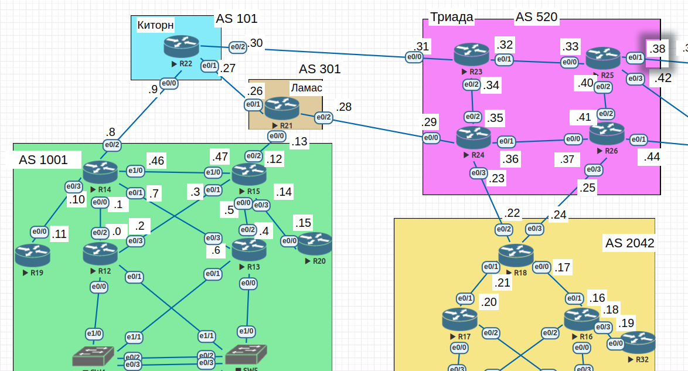

#  BGP. Фильтрация

## Цель

- Настроить фильтрацию для офисе Москва
- Настроить фильтрацию для офисе С.-Петербург

##  Задание:

1. Настроить фильтрацию в офисе Москва так, чтобы не появилось транзитного трафика(As-path).
2. Настроить фильтрацию в офисе С.-Петербург так, чтобы не появилось транзитного трафика(Prefix-list).
3. Настроить провайдера Киторн так, чтобы в офис Москва отдавался только маршрут по умолчанию.
4. Настроить провайдера Ламас так, чтобы в офис Москва отдавался только маршрут по умолчанию и префикс офиса С.-Петербург.
5. Все сети в лабораторной работе должны иметь IP связность.
6. План работы и изменения зафиксированы в документации.

### 1. Общие положения.

#### 1.1 Схема сети



#### 1.2 Таблица адресации


| Device        | Interface     | IP address      | Subnet mask     | Default gateway |
| ------------- | ------------- | --------------- | --------------- | --------------- |
| R14           | e0/0          | 10.0.0.1        | 255.255.255.254 | N/A             |
|               | e0/1          | 10.0.0.7        | 255.255.255.254 | N/A             |
|               | e0/2          | 10.0.0.8        | 255.255.255.254 | N/A             |
|               | e0/3          | 10.0.0.10       | 255.255.255.254 | N/A             |
|               | e1/0          | 10.0.0.46       | 255.255.255.254 | N/A             |
| R15           | e0/0          | 10.0.0.5        | 255.255.255.254 | N/A             |
|               | e0/1          | 10.0.0.3        | 255.255.255.254 | N/A             |
|               | e0/2          | 10.0.0.12       | 255.255.255.254 | N/A             |
|               | e0/3          | 10.0.0.14       | 255.255.255.254 | N/A             |
|               | e1/0          | 10.0.0.47       | 255.255.255.254 | N/A             |
| R18           | e0/0          | 10.0.0.17       | 255.255.255.254 | N/A             |
|               | e0/1          | 10.0.0.21       | 255.255.255.254 | N/A             |
|               | e0/2          | 10.0.0.22       | 255.255.255.254 | N/A             |
|               | e0/3          | 10.0.0.24       | 255.255.255.254 | N/A             |
| R19           | e0/0          | 10.0.0.11       | 255.255.255.254 | N/A             |
|               | lo1           | 10.1.0.19       | 255.255.255.255 | N/A             |
| R20           | e0/0          | 10.0.0.15       | 255.255.255.254 | N/A             |
| R21           | e0/0          | 10.0.0.13       | 255.255.255.254 | N/A             |
|               | e0/1          | 10.0.0.26       | 255.255.255.254 | N/A             |
|               | e0/2          | 10.0.0.28       | 255.255.255.254 | N/A             |
| R22           | e0/0          | 10.0.0.9        | 255.255.255.254 | N/A             |
|               | e0/1          | 10.0.0.27       | 255.255.255.254 | N/A             |
|               | e0/2          | 10.0.0.30       | 255.255.255.254 | N/A             |
| R24           | e0/0          | 10.0.0.29       | 255.255.255.254 | N/A             |
|               | e0/1          | 10.0.0.36       | 255.255.255.254 | N/A             |
|               | e0/2          | 10.0.0.35       | 255.255.255.254 | N/A             |
|               | e0/3          | 10.0.0.23       | 255.255.255.254 | N/A             |
|               | lo1           | 10.1.0.24       | 255.255.255.255 | N/A             |
| R25           | e0/0          | 10.0.0.33       | 255.255.255.254 | N/A             |
|               | e0/1          | 10.0.0.38       | 255.255.255.254 | N/A             |
|               | e0/2          | 10.0.0.40       | 255.255.255.254 | N/A             |
|               | e0/3          | 10.0.0.42       | 255.255.255.254 | N/A             |
|               | lo1           | 10.1.0.25       | 255.255.255.255 | N/A             |
| R26           | e0/0          | 10.0.0.37       | 255.255.255.254 | N/A             |
|               | e0/1          | 10.0.0.44       | 255.255.255.254 | N/A             |
|               | e0/2          | 10.0.0.41       | 255.255.255.254 | N/A             |
|               | e0/3          | 10.0.0.25       | 255.255.255.254 | N/A             |

### 2. Настройка BGP.
#### 2.1 Настроить фильтрацию в офисе Москва так, чтобы не появилось транзитного трафика(As-path).
- Проверяю на R22, с какими AS_PATH приходят объявления от 10.0.0.8
```
R22#show ip bgp | inc 10.0.0.8
 *                    10.0.0.8                 0             0 1001 1001 1001 1001 ?
 *                    10.0.0.8                               0 1001 1001 1001 1001 ?
 *                    10.0.0.8                               0 1001 1001 1001 1001 ?
 *                    10.0.0.8                 0             0 1001 1001 1001 1001 ?
 *   10.0.0.8/31      10.0.0.26                              0 301 1001 i
 *                    10.0.0.8                 0             0 1001 1001 1001 1001 i
 *                    10.0.0.8                 0             0 1001 1001 1001 1001 ?
 *                    10.0.0.8                               0 1001 1001 1001 1001 ?
 *                    10.0.0.8                               0 1001 1001 1001 1001 ?
 *   10.0.0.16/31     10.0.0.8                               0 1001 1001 1001 1001 301 520 2042 ?
 *   10.0.0.20/31     10.0.0.8                               0 1001 1001 1001 1001 301 520 2042 ?
 *   10.0.0.22/31     10.0.0.8                               0 1001 1001 1001 1001 301 520 ?
 *   10.0.0.24/31     10.0.0.8                               0 1001 1001 1001 1001 301 520 2042 ?
 *   10.0.0.26/31     10.0.0.8                               0 1001 1001 1001 1001 301 ?
 *   10.0.0.28/31     10.0.0.8                               0 1001 1001 1001 1001 301 ?
 *   10.0.0.30/31     10.0.0.8                               0 1001 1001 1001 1001 301 520 i
 *   10.0.0.32/31     10.0.0.8                               0 1001 1001 1001 1001 301 520 ?
 *   10.0.0.34/31     10.0.0.8                               0 1001 1001 1001 1001 301 520 ?
 *   10.0.0.36/31     10.0.0.8                               0 1001 1001 1001 1001 301 520 ?
 *   10.0.0.38/31     10.0.0.8                               0 1001 1001 1001 1001 301 520 ?
 *   10.0.0.40/31     10.0.0.8                               0 1001 1001 1001 1001 301 520 ?
 *   10.0.0.42/31     10.0.0.8                               0 1001 1001 1001 1001 301 520 ?
 *                    10.0.0.8                 0             0 1001 1001 1001 1001 ?
 *   10.1.0.24/32     10.0.0.8                               0 1001 1001 1001 1001 301 520 ?
 *   10.1.0.25/32     10.0.0.8                               0 1001 1001 1001 1001 301 520 ?
 *   192.168.102.0    10.0.0.8                               0 1001 1001 1001 1001 301 520 i

```
- Для реализации фильтрации создаю на R14 и R15 правило ip as-path access-list и применяю на соседа.
```
R14(config)#ip as-path access-list 1 permit ^$
R14(config)#router bgp 1001
R14(config-router)#neighbor 10.0.0.9 filter-list 1 out

```
- Проверяю на R22 теперь.
```
R22#show ip bgp | inc 10.0.0.8
 *                    10.0.0.8                 0             0 1001 1001 1001 1001 ?
 *                    10.0.0.8                               0 1001 1001 1001 1001 ?
 *                    10.0.0.8                               0 1001 1001 1001 1001 ?
 *                    10.0.0.8                 0             0 1001 1001 1001 1001 ?
 *   10.0.0.8/31      10.0.0.26                              0 301 1001 i
 *                    10.0.0.8                 0             0 1001 1001 1001 1001 i
 *                    10.0.0.8                 0             0 1001 1001 1001 1001 ?
 *                    10.0.0.8                               0 1001 1001 1001 1001 ?
 *                    10.0.0.8                               0 1001 1001 1001 1001 ?
 *                    10.0.0.8                 0             0 1001 1001 1001 1001 ?
R22#
```
- Остался только маршрут на сам R14 через Ламас.
- Повторяю то же самое на R15.

#### 2.2 Настроить фильтрацию в офисе С.-Петербург так, чтобы не появилось транзитного трафика(Prefix-list).
- Что сейчас получает R24 из AS 2042:
```
R24#show ip bgp | inc 2042
 * i 10.0.0.16/31     10.0.0.24                0    100      0 2042 ?
 *>                   10.0.0.22                0             0 2042 ?
 * i 10.0.0.20/31     10.0.0.24                0    100      0 2042 ?
 *>                   10.0.0.22                0             0 2042 ?
 *   10.0.0.22/31     10.0.0.22                0             0 2042 i
 * i 10.0.0.24/31     10.0.0.24                0    100      0 2042 ?
 *>                   10.0.0.22                0             0 2042 ?
```
- Допустим, что я хочу отправлять только 10.0.0.16/31
```
R18(config)#ip prefix-list NO-TRANSIT seq 5 permit 10.0.0.16/31

R18(config-router)#router bgp 2042
R18(config-router)#neighbor 10.0.0.23 prefix-list NO-TRANSIT out
R18(config-router)#neighbor 10.0.0.25 prefix-list NO-TRANSIT out

```
- Что на R24:
```
R24#show ip bgp | inc 2042
* i 10.0.0.16/31     10.0.0.24                0    100      0 2042 ?
*>                   10.0.0.22                0             0 2042 ?
```
#### 2.3 Настроить провайдера Киторн так, чтобы в офис Москва отдавался только маршрут по умолчанию.
- Включаю soft-reconfiguration inbound и смотрю, что приходит на R14 со стороны R22:
```
R14(config-router)#neighbor 10.0.0.9  soft-reconfiguration inbound

R14#show ip bgp ipv4 unicast neighbors 10.0.0.9 received-routes
BGP table version is 45, local router ID is 10.0.0.46
Status codes: s suppressed, d damped, h history, * valid, > best, i - internal,
              r RIB-failure, S Stale, m multipath, b backup-path, f RT-Filter,
              x best-external, a additional-path, c RIB-compressed,
Origin codes: i - IGP, e - EGP, ? - incomplete
RPKI validation codes: V valid, I invalid, N Not found

     Network          Next Hop            Metric LocPrf Weight Path
 *   10.0.0.8/31      10.0.0.9                 0             0 101 ?
 *   10.0.0.12/31     10.0.0.9                               0 101 301 ?
 *   10.0.0.16/31     10.0.0.9                               0 101 520 2042 ?
 *   10.0.0.22/31     10.0.0.9                               0 101 520 ?
 *   10.0.0.26/31     10.0.0.9                 0             0 101 ?
 *   10.0.0.28/31     10.0.0.9                               0 101 301 ?
 *   10.0.0.30/31     10.0.0.9                 0             0 101 ?
 *   10.0.0.32/31     10.0.0.9                               0 101 520 ?
 *   10.0.0.34/31     10.0.0.9                               0 101 520 ?
 *   10.0.0.36/31     10.0.0.9                               0 101 520 ?
 *   10.0.0.38/31     10.0.0.9                               0 101 520 ?
 *   10.0.0.40/31     10.0.0.9                               0 101 520 ?
 *   10.0.0.42/31     10.0.0.9                               0 101 520 ?
 *   10.1.0.24/32     10.0.0.9                               0 101 520 ?
 *   10.1.0.25/32     10.0.0.9                               0 101 520 ?
 *   192.168.102.0    10.0.0.9                               0 101 520 i

Total number of prefixes 16

```
- Создаю на R22 дефолтный маршрут и объявляем его в bgp:
```
R22(config)#ip route 0.0.0.0 0.0.0.0 null 0
```
- Он появляется на R14:
```
R14#show ip bgp ipv4 unicast neighbors 10.0.0.9 received-routes
BGP table version is 47, local router ID is 10.0.0.46
Status codes: s suppressed, d damped, h history, * valid, > best, i - internal,
              r RIB-failure, S Stale, m multipath, b backup-path, f RT-Filter,
              x best-external, a additional-path, c RIB-compressed,
Origin codes: i - IGP, e - EGP, ? - incomplete
RPKI validation codes: V valid, I invalid, N Not found

     Network          Next Hop            Metric LocPrf Weight Path
 *   0.0.0.0          10.0.0.9                               0 101 i
 *   10.0.0.8/31      10.0.0.9                 0             0 101 ?
 *   10.0.0.12/31     10.0.0.9                               0 101 301 ?
 *   10.0.0.16/31     10.0.0.9                               0 101 520 2042 ?
 *   10.0.0.22/31     10.0.0.9                               0 101 520 ?
 *   10.0.0.26/31     10.0.0.9                 0             0 101 ?
 *   10.0.0.28/31     10.0.0.9                               0 101 301 ?
 *   10.0.0.30/31     10.0.0.9                 0             0 101 ?
 *   10.0.0.32/31     10.0.0.9                               0 101 520 ?
 *   10.0.0.34/31     10.0.0.9                               0 101 520 ?
 *   10.0.0.36/31     10.0.0.9                               0 101 520 ?
 *   10.0.0.38/31     10.0.0.9                               0 101 520 ?
 *   10.0.0.40/31     10.0.0.9                               0 101 520 ?
 *   10.0.0.42/31     10.0.0.9                               0 101 520 ?
 *   10.1.0.24/32     10.0.0.9                               0 101 520 ?
 *   10.1.0.25/32     10.0.0.9                               0 101 520 ?
 *   192.168.102.0    10.0.0.9                               0 101 520 i

 Total number of prefixes 17
```
- Теперь нужен prefix-list в сторону R14:
```
R22(config)#ip prefix-list DEF_R seq 10 permit 0.0.0.0/0

R22(config-router)#neighbor 10.0.0.8 prefix-list DEF_R out
```
- Что на R14:
```
R14#show ip bgp ipv4 unicast neighbors 10.0.0.9 received-routes
BGP table version is 47, local router ID is 10.0.0.46
Status codes: s suppressed, d damped, h history, * valid, > best, i - internal,
              r RIB-failure, S Stale, m multipath, b backup-path, f RT-Filter,
              x best-external, a additional-path, c RIB-compressed,
Origin codes: i - IGP, e - EGP, ? - incomplete
RPKI validation codes: V valid, I invalid, N Not found

     Network          Next Hop            Metric LocPrf Weight Path
 *   0.0.0.0          10.0.0.9                               0 101 i

Total number of prefixes 1
```
- Остался один дефолт.
```
R14#show ip bgp  
BGP table version is 47, local router ID is 10.0.0.46
Status codes: s suppressed, d damped, h history, * valid, > best, i - internal,
              r RIB-failure, S Stale, m multipath, b backup-path, f RT-Filter,
              x best-external, a additional-path, c RIB-compressed,
Origin codes: i - IGP, e - EGP, ? - incomplete
RPKI validation codes: V valid, I invalid, N Not found

     Network          Next Hop            Metric LocPrf Weight Path
 *>i 0.0.0.0          10.0.0.13                0    100      0 301 101 i
 *                    10.0.0.9                       50      0 101 i
 *>  10.0.0.0/31      0.0.0.0                  0         32768 ?
 r>i 10.0.0.2/31      10.0.0.47                0    100      0 ?
 r>i 10.0.0.4/31      10.0.0.47                0    100      0 ?
 *>  10.0.0.6/31      0.0.0.0                  0         32768 ?
 *>  10.0.0.8/31      0.0.0.0                  0         32768 i
 *>  10.0.0.10/31     0.0.0.0                  0         32768 ?
 *>i 10.0.0.12/31     10.0.0.47                0    100      0 ?
 r>i 10.0.0.14/31     10.0.0.47                0    100      0 ?
 *>i 10.0.0.16/31     10.0.0.13                0    100      0 301 520 2042 ?
 *>i 10.0.0.22/31     10.0.0.13                0    100      0 301 520 ?
 *>i 10.0.0.26/31     10.0.0.13                0    100      0 301 ?
 *>i 10.0.0.28/31     10.0.0.13                0    100      0 301 ?
 *>i 10.0.0.30/31     10.0.0.13                0    100      0 301 520 i
 *>i 10.0.0.32/31     10.0.0.13                0    100      0 301 520 ?
 *>i 10.0.0.34/31     10.0.0.13                0    100      0 301 520 ?
 *>i 10.0.0.36/31     10.0.0.13                0    100      0 301 520 ?
 *>i 10.0.0.38/31     10.0.0.13                0    100      0 301 520 ?
 *>i 10.0.0.40/31     10.0.0.13                0    100      0 301 520 ?
 *>i 10.0.0.42/31     10.0.0.13                0    100      0 301 520 ?
 * i 10.0.0.46/31     10.0.0.47                0    100      0 ?
 *>                   0.0.0.0                  0         32768 ?
 *>i 10.1.0.24/32     10.0.0.13                0    100      0 301 520 ?
 *>i 10.1.0.25/32     10.0.0.13                0    100      0 301 520 ?
 *>i 192.168.102.0    10.0.0.13                0    100      0 301 520 i

```
- Все остальные маршруты от 10.0.0.47 (R15) или через него от 10.0.0.13 (R21).
