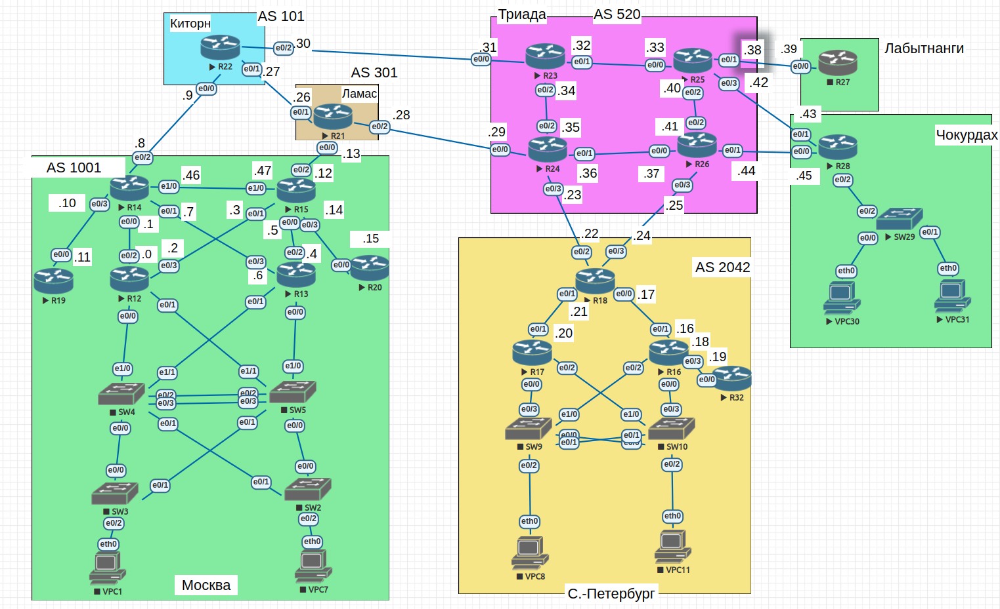

#  Основные протоколы сети интернет

## Цель

- Настроить DHCP в офисе Москва
- Настроить синхронизацию времени в офисе Москва
- Настроить NAT в офисе Москва, C.-Перетбруг и Чокурдах

##  Задание:

1. Настроить NAT(PAT) на R14 и R15. Трансляция должна осуществляться в адрес автономной системы AS1001.
2. Настроить NAT(PAT) на R18. Трансляция должна осуществляться в пул из 5 адресов автономной системы AS2042.
3. Настроить статический NAT для R20.
4. Настроить NAT так, чтобы R19 был доступен с любого узла для удаленного управления.
5. Настроить статический NAT(PAT) для офиса Чокурдах.
6. Настроить для IPv4 DHCP сервер в офисе Москва на маршрутизаторах R12 и R13. VPC1 и VPC7 должны получать сетевые настройки по DHCP.
7. Настроить NTP сервер на R12 и R13. Все устройства в офисе Москва должны синхронизировать время с R12 и R13.

### 1. Общие положения.

#### 1.1 Схема сети

#### 1.2 Таблица адресации

| Device        | Interface     | IP address      | Subnet mask     | Default gateway |
| ------------- | ------------- | --------------- | --------------- | --------------- |
| R12           | VLAN10        | 192.168.100.2   | 255.255.255.128 | N/A             |
|               | VLAN20        | 192.168.100.130 | 255.255.255.128 | N/A             |
|               | VLAN40        | 172.16.100.2    | 255.255.255.0   | N/A             |
|               | e0/2          | 10.0.0.0        | 255.255.255.254 | N/A             |
|               | e0/3          | 10.0.0.2        | 255.255.255.254 | N/A             |
| R13           | VLAN10        | 192.168.100.3   | 255.255.255.128 | N/A             |
|               | VLAN20        | 192.168.100.131 | 255.255.255.128 | N/A             |
|               | VLAN40        | 172.16.100.3    | 255.255.255.0   | N/A             |
|               | e0/2          | 10.0.0.4        | 255.255.255.254 | N/A             |
|               | e0/3          | 10.0.0.6        | 255.255.255.254 | N/A             |
| R14           | e0/0          | 10.0.0.1        | 255.255.255.254 | N/A             |
|               | e0/1          | 10.0.0.7        | 255.255.255.254 | N/A             |
|               | e0/2          | 10.0.0.8        | 255.255.255.254 | N/A             |
|               | e0/3          | 10.0.0.10       | 255.255.255.254 | N/A             |
|               | e1/0          | 10.0.0.46       | 255.255.255.254 | N/A             |
| R15           | e0/0          | 10.0.0.5        | 255.255.255.254 | N/A             |
|               | e0/1          | 10.0.0.3        | 255.255.255.254 | N/A             |
|               | e0/2          | 10.0.0.12       | 255.255.255.254 | N/A             |
|               | e0/3          | 10.0.0.14       | 255.255.255.254 | N/A             |
|               | e1/0          | 10.0.0.47       | 255.255.255.254 | N/A             |
| R18           | e0/0          | 10.0.0.17       | 255.255.255.254 | N/A             |
|               | e0/1          | 10.0.0.21       | 255.255.255.254 | N/A             |
|               | e0/2          | 10.0.0.22       | 255.255.255.254 | N/A             |
|               | e0/3          | 10.0.0.24       | 255.255.255.254 | N/A             |
| R19           | e0/0          | 10.0.0.11       | 255.255.255.254 | N/A             |
|               | lo1           | 10.1.0.19       | 255.255.255.255 | N/A             |
| R20           | e0/0          | 10.0.0.15       | 255.255.255.254 | N/A             |

### 2. Настройка.
#### 2.1 Настроить NAT(PAT) на R14 и R15. Трансляция должна осуществляться в адрес автономной системы AS1001.
#### 2.2 Настроить NAT(PAT) на R18. Трансляция должна осуществляться в пул из 5 адресов автономной системы AS2042.
#### 2.3 Настроить статический NAT для R20.
#### 2.4 Настроить NAT так, чтобы R19 был доступен с любого узла для удаленного управления.
#### 2.5 Настроить статический NAT(PAT) для офиса Чокурдах.
#### 2.6 Настроить для IPv4 DHCP сервер в офисе Москва на маршрутизаторах R12 и R13. VPC1 и VPC7 должны получать сетевые настройки по DHCP.
#### 2.7 Настроить NTP сервер на R12 и R13. Все устройства в офисе Москва должны синхронизировать время с R12 и R13.
