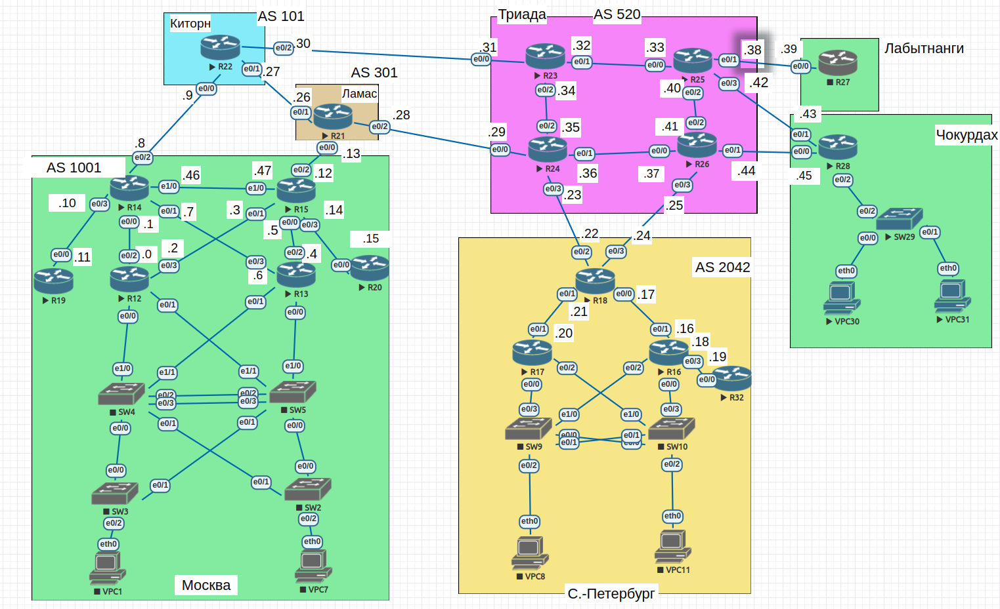

#  VPN. GRE. DmVPN

## Цель

- Настроить GRE между офисами Москва и С.-Петербург
- Настроить DMVPN между офисами Москва и Чокурдах, Лабытнанги

##  Задание:

1. Настроите GRE между офисами Москва и С.-Петербург.
2. Настроите DMVMN между Москва и Чокурдах, Лабытнанги.

- Все узлы в офисах в лабораторной работе должны иметь IP связность.
- План работы и изменения зафиксированы в документации.

### 1. Общие положения.

#### 1.1 Схема сети



#### 1.2 Таблица адресации


| Device        | Interface     | IP address      | Subnet mask     | Default gateway |
| ------------- | ------------- | --------------- | --------------- | --------------- |
| R12           | VLAN10        | 192.168.100.2   | 255.255.255.128 | N/A             |
|               | VLAN20        | 192.168.100.130 | 255.255.255.128 | N/A             |
|               | VLAN40        | 172.16.100.2    | 255.255.255.0   | N/A             |
|               | e0/2          | 10.0.0.0        | 255.255.255.254 | N/A             |
|               | e0/3          | 10.0.0.2        | 255.255.255.254 | N/A             |
| R13           | VLAN10        | 192.168.100.3   | 255.255.255.128 | N/A             |
|               | VLAN20        | 192.168.100.131 | 255.255.255.128 | N/A             |
|               | VLAN40        | 172.16.100.3    | 255.255.255.0   | N/A             |
|               | e0/2          | 10.0.0.4        | 255.255.255.254 | N/A             |
|               | e0/3          | 10.0.0.6        | 255.255.255.254 | N/A             |
| R14           | e0/0          | 10.0.0.1        | 255.255.255.254 | N/A             |
|               | e0/1          | 10.0.0.7        | 255.255.255.254 | N/A             |
|               | e0/2          | 10.0.0.8        | 255.255.255.254 | N/A             |
|               | e0/3          | 10.0.0.10       | 255.255.255.254 | N/A             |
|               | e1/0          | 10.0.0.46       | 255.255.255.254 | N/A             |
| R15           | e0/0          | 10.0.0.5        | 255.255.255.254 | N/A             |
|               | e0/1          | 10.0.0.3        | 255.255.255.254 | N/A             |
|               | e0/2          | 10.0.0.12       | 255.255.255.254 | N/A             |
|               | e0/3          | 10.0.0.14       | 255.255.255.254 | N/A             |
|               | e1/0          | 10.0.0.47       | 255.255.255.254 | N/A             |
|               |               | 10.10.0.16      | 255.255.255.255 | N/A             |
| R18           | e0/0          | 10.0.0.17       | 255.255.255.254 | N/A             |
|               | e0/1          | 10.0.0.21       | 255.255.255.254 | N/A             |
|               | e0/2          | 10.0.0.22       | 255.255.255.254 | N/A             |
|               | e0/3          | 10.0.0.24       | 255.255.255.254 | N/A             |
| R19           | e0/0          | 10.0.0.11       | 255.255.255.254 | N/A             |
|               | lo1           | 10.1.0.19       | 255.255.255.255 | N/A             |
| R20           | e0/0          | 10.0.0.15       | 255.255.255.254 | N/A             |

#### 1.3 GRE Tunnel IP.

| Interface     | IP address     | Tunnel source   | Tunnel destination |
|---------------|----------------|-----------------|--------------------|
| tunnel0@R15   | 10.20.0.1/24   | 10.0.0.12       | 10.0.0.22          |
| tunnel0@R18   | 10.20.0.2/24   | 10.0.0.22       | 10.10.0.12         |

#### 1.3 DMVMN Tunnel IP.

| Interface     | IP address     | Tunnel source   | Tunnel destination |
|---------------|----------------|-----------------|--------------------|
| tunnel1@R15   | 10.20.1.1/24   | e0/2            | 10.0.0.22          |
| tunnel1@R28   | 10.20.1.2/24   | 10.0.0.45       | 10.10.0.12         |
| tunnel1@R27   | 10.20.1.3/24   | 10.0.0.39       | 10.10.0.12         |


### 2. Настройка.
#### 2.1 Настроите GRE между офисами Москва и С.-Петербург.
- Настраиваю интерфейс на R15.
```
R15(config)#interface Tunnel0
R15(config-if)#
*Jan 19 14:09:01.372: %LINEPROTO-5-UPDOWN: Line protocol on Interface Tunnel0, changed state to down
R15(config-if)#ip address 10.20.0.1 255.255.255.0
R15(config-if)#ip mtu 1400
R15(config-if)#ip tcp adjust-mss 1360
R15(config-if)#tunnel source 10.0.0.12
R15(config-if)#tunnel destination 10.0.0.22
*Jan 19 14:19:06.467: %LINEPROTO-5-UPDOWN: Line protocol on Interface Tunnel0, changed state to up
R15(config-if)#exit
```
- Настраиваю интерфейс на R18.
```
R18(config)#interface tunnel0
*Jan 19 14:19:44.431: %LINEPROTO-5-UPDOWN: Line protocol on Interface Tunnel0, changed state to down
R18(config-if)#ip address 10.20.0.2 255.255.255.0
R18(config-if)#ip mtu 1400
R18(config-if)#ip tcp adjust-mss 1360
R18(config-if)#tunnel source 10.0.0.22
R18(config-if)#tunnel destination 10.0.0.12
R18(config-if)#
*Jan 19 14:21:25.506: %LINEPROTO-5-UPDOWN: Line protocol on Interface Tunnel0, changed state to up
R18(config-if)#exit

```
- Проверяю.
```
R15#ping 10.20.0.2
Type escape sequence to abort.
Sending 5, 100-byte ICMP Echos to 10.20.0.2, timeout is 2 seconds:
!!!!!
Success rate is 100 percent (5/5), round-trip min/avg/max = 1/1/2 ms

R18#ping 10.20.0.1
Type escape sequence to abort.
Sending 5, 100-byte ICMP Echos to 10.20.0.1, timeout is 2 seconds:
!!!!!
Success rate is 100 percent (5/5), round-trip min/avg/max = 1/1/2 ms

```


#### 2.2 Настроите DMVMN между Москва и Чокурдах, Лабытнанги.
- Настраиваю сервер в Москве.
```
R15(config)#interface tunnel 1
R15(config-if)#
*Jan 19 14:47:14.851: %LINEPROTO-5-UPDOWN: Line protocol on Interface Tunnel1, changed state to down
R15(config-if)#tunnel mode gre multipoint
R15(config-if)#ip address 10.20.1.1 255.255.255.0
R15(config-if)#tunnel source e0/2
R15(config-if)#
*Jan 19 14:48:29.988: %LINEPROTO-5-UPDOWN: Line protocol on Interface Tunnel1, changed state to up
R15(config-if)#ip mtu 1400
R15(config-if)#ip tcp adjust-mss 1360
R15(config-if)#ip nhrp network-id 100
R15(config-if)#ip nhrp authentication SUTO
R15(config-if)#ip nhrp map multicast dynamic
```
- Настраиваю клиент на R28.
```
R28(config)#interface tunnel 1
*Jan 19 14:51:36.210: %LINEPROTO-5-UPDOWN: Line protocol on Interface Tunnel1, changed state to down
R28(config-if)#tunnel mode gre multipoint
R28(config-if)#ip address 10.20.1.2 255.255.255.0
R28(config-if)#tunnel source e0/0
R28(config-if)#
*Jan 19 14:53:14.280: %LINEPROTO-5-UPDOWN: Line protocol on Interface Tunnel1, changed state to up
R28(config-if)#ip mtu 1400    
R28(config-if)#ip tcp adjust-mss 1360
R28(config-if)#ip nhrp network-id 100
R28(config-if)#ip nhrp authentication SUTO
R28(config-if)#ip nhrp map multicast 10.0.0.12
R28(config-if)#ip nhrp nhs 10.20.1.1
R28(config-if)#ip nhrp map 10.20.1.1 10.0.0.12

```
- Проверяю.
```
R15#ping 10.20.1.2
Type escape sequence to abort.
Sending 5, 100-byte ICMP Echos to 10.20.1.2, timeout is 2 seconds:
!!!!!
Success rate is 100 percent (5/5), round-trip min/avg/max = 1/1/2 ms

R28#ping 10.20.1.1
Type escape sequence to abort.
Sending 5, 100-byte ICMP Echos to 10.20.1.1, timeout is 2 seconds:
!!!!!
Success rate is 100 percent (5/5), round-trip min/avg/max = 1/1/2 ms
```

- Добавляю R27.
```
R27(config)#interface tunnel 1
*Jan 19 15:02:19.285: %LINEPROTO-5-UPDOWN: Line protocol on Interface Tunnel1, changed state to down
R27(config-if)#tunnel mode gre multipoint
R27(config-if)#ip address 10.20.1.3 255.255.255.0
R27(config-if)#tunnel source e0/0
R27(config-if)#
*Jan 19 15:03:09.883: %LINEPROTO-5-UPDOWN: Line protocol on Interface Tunnel1, changed state to up
R27(config-if)#ip mtu 1400
R27(config-if)#ip tcp adjust-mss 1360
R27(config-if)#ip nhrp network-id 100
R27(config-if)#ip nhrp authentication SUTO
R27(config-if)#ip nhrp map multicast 10.0.0.12
R27(config-if)#ip nhrp nhs 10.20.1.1
R27(config-if)#ip nhrp map 10.20.1.1 10.0.0.12
```
- Проверяю.
```
R15#ping 10.20.1.3
Type escape sequence to abort.
Sending 5, 100-byte ICMP Echos to 10.20.1.3, timeout is 2 seconds:
!!!!!
Success rate is 100 percent (5/5), round-trip min/avg/max = 1/2/3 ms

R27#ping 10.20.1.1
Type escape sequence to abort.
Sending 5, 100-byte ICMP Echos to 10.20.1.1, timeout is 2 seconds:
!!!!!
Success rate is 100 percent (5/5), round-trip min/avg/max = 1/2/3 ms
R27#ping 10.20.1.2
Type escape sequence to abort.
Sending 5, 100-byte ICMP Echos to 10.20.1.2, timeout is 2 seconds:
!!!!!
Success rate is 100 percent (5/5), round-trip min/avg/max = 1/5/9 ms

R28#ping 10.20.1.3
Type escape sequence to abort.
Sending 5, 100-byte ICMP Echos to 10.20.1.3, timeout is 2 seconds:
!!!!!
Success rate is 100 percent (5/5), round-trip min/avg/max = 1/2/5 ms

```
- Всё пингуется.
