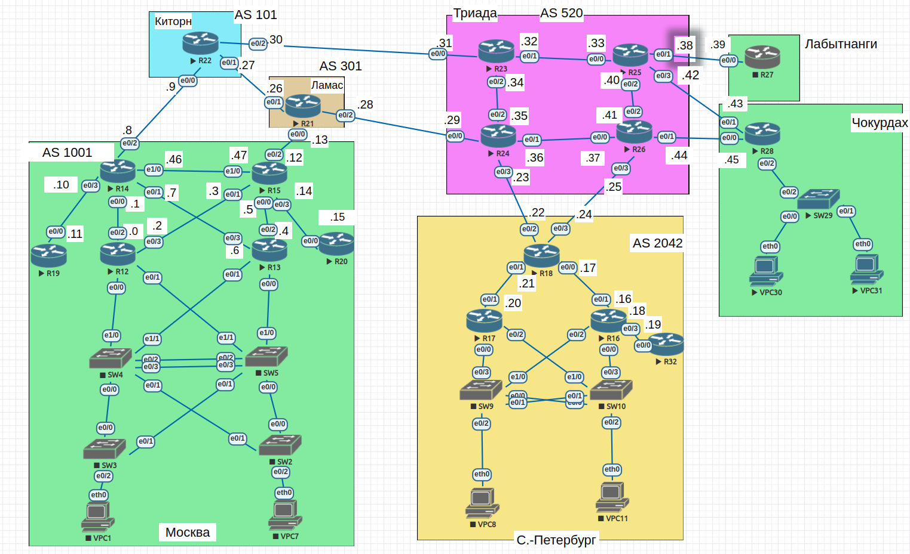

#  IPSec over DmVPN


## Цель

- Настроить GRE поверх IPSec между офисами Москва и С.-Петербург
- Настроить DMVPN поверх IPSec между офисами Москва и Чокурдах, Лабытнанги

##  Задание:

1. Настроите GRE поверх IPSec между офисами Москва и С.-Петербург.
2. Настроите DMVPN поверх IPSec между Москва и Чокурдах, Лабытнанги.

- Все узлы в офисах в лабораторной работе должны иметь IP связность.
- План работы и изменения зафиксированы в документации.

### 1. Общие положения.

#### 1.1 Схема сети



#### 1.2 Таблица адресации


| Device        | Interface     | IP address      | Subnet mask     |
| ------------- | ------------- | --------------- | --------------- |
| R14           | e0/0          | 10.0.0.1        | 255.255.255.254 |
|               | e0/1          | 10.0.0.7        | 255.255.255.254 |
|               | e0/2          | 10.0.0.8        | 255.255.255.254 |
|               | e0/3          | 10.0.0.10       | 255.255.255.254 |
|               | e1/0          | 10.0.0.46       | 255.255.255.254 |
| R15           | e0/0          | 10.0.0.5        | 255.255.255.254 |
|               | e0/1          | 10.0.0.3        | 255.255.255.254 |
|               | e0/2          | 10.0.0.12       | 255.255.255.254 |
|               | e0/3          | 10.0.0.14       | 255.255.255.254 |
|               | e1/0          | 10.0.0.47       | 255.255.255.254 |
| R18           | e0/0          | 10.0.0.17       | 255.255.255.254 |
|               | e0/1          | 10.0.0.21       | 255.255.255.254 |
|               | e0/2          | 10.0.0.22       | 255.255.255.254 |
|               | e0/3          | 10.0.0.24       | 255.255.255.254 |
| R27           | e0/0          | 10.0.0.39       | 255.255.255.254 |
| R28           | e0/0          | 10.0.0.45       | 255.255.255.254 |
|               | e0/1          | 10.0.0.43       | 255.255.255.254 |
|               | e0/2.10       | 192.168.102.1   | 255.255.255.128 |
|               | e0/2.20       | 192.168.102.129 | 255.255.255.128 |
|               | e0/2.40       | 172.16.102.1    | 255.255.255.0   |
|               | lo1           | 10.1.0.28       | 255.255.255.255 |

#### 1.3 GRE Tunnel IP.

| Interface     | IP address     | Tunnel source   | Tunnel destination |
|---------------|----------------|-----------------|--------------------|
| tunnel0@R15   | 10.20.0.1/24   | 10.0.0.12       | 10.0.0.22          |
| tunnel0@R16   | 10.20.0.2/24   | 10.1.0.16       | 10.1.0.13          |

#### 1.3 DMVMN Tunnel IP.

| Interface     | IP address     | Tunnel source   | Tunnel destination |
|---------------|----------------|-----------------|--------------------|
| tunnel1@R13   | 10.20.1.1/24   | e0/2            | -                  |
| tunnel1@R28   | 10.20.1.2/24   | 10.1.0.28       | 10.0.0.12          |
| tunnel1@R27   | 10.20.1.3/24   | e0/0            | 10.0.0.12          |


### 2. Настройка.
#### 2.1 Настроите GRE поверх IPSec между офисами Москва и С.-Петербург.
- Тоннель GRE между R15 и R18 уже сделан в прошлом задании, сделаю его поверх IPSEC.
- Для начала разверну CA на R14 и сделаю через него заверенные сертификаты для R15 и R18.
- CA на R14
```
R14(config)#ip domain-name suto.ur
R14(config)#ip http server
R14(config)#$crypto key generate rsa general-keys label CA exportable modulus 2048      
The name for the keys will be: CA

% The key modulus size is 2048 bits
% Generating 2048 bit RSA keys, keys will be exportable...
[OK] (elapsed time was 6 seconds)

R14(config)#
*Mar 11 08:48:42.301: %SSH-5-ENABLED: SSH 1.99 has been enabled
R14(config)#crypto pki server CA
R14(cs-server)#no shutdown
%Some server settings cannot be changed after CA certificate generation.
% Please enter a passphrase to protect the private key
% or type Return to exit
Password:

Re-enter password:

% Certificate Server enabled.
R14(cs-server)#
```
- На R15
```
R15(config)#crypto pki trustpoint VPN
R15(ca-trustpoint)#enrollment url http://10.0.0.46
R15(ca-trustpoint)#subj
R15(ca-trustpoint)#subject-n
R15(ca-trustpoint)#subject-name CN=R15,OU=VPN,O=MSK,C=RU
R15(ca-trustpoint)#rsakeypair VPN
R15(ca-trustpoint)#revocation-check none
R15(ca-trustpoint)#exit
R15(config)#crypto pki authenticate VPN
Certificate has the following attributes:
       Fingerprint MD5: C023BED0 96C3C705 2802E032 B97A767B
      Fingerprint SHA1: 854E6C28 A1F0AAEF 43D5B3C6 0FFDA63A E438DC13

% Do you accept this certificate? [yes/no]: yes
Trustpoint CA certificate accepted.
R15(config)#crypto pki enroll VPN
%
% Start certificate enrollment ..
% Create a challenge password. You will need to verbally provide this
   password to the CA Administrator in order to revoke your certificate.
   For security reasons your password will not be saved in the configuration.
   Please make a note of it.

Password:
*Mar 11 09:36:21.169:  RSA key size needs to be atleast 768 bits for ssh version 2
*Mar 11 09:36:21.174: %SSH-5-ENABLED: SSH 1.5 has been enabled
*Mar 11 09:36:21.175: %CRYPTO-6-AUTOGEN: Generated new 512 bit key pair
Re-enter password:

% The subject name in the certificate will include: CN=R15,OU=VPN,O=MSK,C=RU
% The subject name in the certificate will include: R15
% Include the router serial number in the subject name? [yes/no]: no
% Include an IP address in the subject name? [no]: no
Request certificate from CA? [yes/no]: yes
% Certificate request sent to Certificate Authority
% The 'show crypto pki certificate verbose VPN' commandwill show the fingerprint.

R15(config)#
*Mar 11 09:36:55.392: CRYPTO_PKI:  Certificate Request Fingerprint MD5: 47D549D4 D89F94C4 229177DB 8ED8F692
*Mar 11 09:36:55.392: CRYPTO_PKI:  Certificate Request Fingerprint SHA1: 953EEE6F 4D1F62CB B9A5F98A 1D799A0F 32BEA96D
R15(config)#
```
- На R18
```
R18(config)#crypto pki trustpoint VPN
R18(ca-trustpoint)#enrollment url http://10.0.0.46
R18(ca-trustpoint)#subject-name CN=R18,OU=VPN,O=SPB,C=RU
R18(ca-trustpoint)#rsakeypair VPN
R18(ca-trustpoint)#revocation-check none
R18(ca-trustpoint)#exit
R18(config)#crypto pki authenticate VPN
Certificate has the following attributes:
       Fingerprint MD5: C023BED0 96C3C705 2802E032 B97A767B
      Fingerprint SHA1: 854E6C28 A1F0AAEF 43D5B3C6 0FFDA63A E438DC13

% Do you accept this certificate? [yes/no]: yes
Trustpoint CA certificate accepted.
R18(config)#crypto pki enroll VPN
%
% Start certificate enrollment ..
% Create a challenge password. You will need to verbally provide this
   password to the CA Administrator in order to revoke your certificate.
   For security reasons your password will not be saved in the configuration.
   Please make a note of it.

Password:
Re-enter password:

% The subject name in the certificate will include: CN=R18,OU=VPN,O=SPB,C=RU
% The subject name in the certificate will include: R18
% Include the router serial number in the subject name? [yes/no]: no
% Include an IP address in the subject name? [no]: no
Request certificate from CA? [yes/no]: yes
% Certificate request sent to Certificate Authority
% The 'show crypto pki certificate verbose VPN' commandwill show the fingerprint.

R18(config)#
*Mar 11 08:54:47.970: CRYPTO_PKI:  Certificate Request Fingerprint MD5: 5DB18631 283203DC 1182E0EC 3E5D41BA
*Mar 11 08:54:47.970: CRYPTO_PKI:  Certificate Request Fingerprint SHA1: 99FD041D A616635D 27AD130E 5F05DBF7 CB4CE3D1
R18(config)#
```
- Подписываю сертификаты на R14.
```
R14#sho crypto pki server CA requests
Enrollment Request Database:

Subordinate CA certificate requests:
ReqID  State      Fingerprint                      SubjectName
--------------------------------------------------------------

RA certificate requests:
ReqID  State      Fingerprint                      SubjectName
--------------------------------------------------------------

Router certificates requests:
ReqID  State      Fingerprint                      SubjectName
--------------------------------------------------------------
2      pending    47D549D4D89F94C4229177DB8ED8F692 hostname=R15,cn=R15,ou=VPN,o=MSK,c=RU
1      pending    5DB18631283203DC1182E0EC3E5D41BA hostname=R18,cn=R18,ou=VPN,o=SPB,c=RU

R14#crypto pki server CA grant a
R14#crypto pki server CA grant all
R14#sho crypto pki server CA requests
Enrollment Request Database:

Subordinate CA certificate requests:
ReqID  State      Fingerprint                      SubjectName
--------------------------------------------------------------

RA certificate requests:
ReqID  State      Fingerprint                      SubjectName
--------------------------------------------------------------

Router certificates requests:
ReqID  State      Fingerprint                      SubjectName
--------------------------------------------------------------
2      granted    47D549D4D89F94C4229177DB8ED8F692 hostname=R15,cn=R15,ou=VPN,o=MSK,c=RU
1      granted    5DB18631283203DC1182E0EC3E5D41BA hostname=R18,cn=R18,ou=VPN,o=SPB,c=RU

```
- Проверяю на R15 и R18.
```
R15(config)#do sho crypto pki certificates
Certificate
  Status: Available
  Certificate Serial Number (hex): 02
  Certificate Usage: General Purpose
  Issuer:
    cn=CA
  Subject:
    Name: R15
    hostname=R15
    cn=R15
    ou=VPN
    o=MSK
    c=RU
  Validity Date:
    start date: 09:39:21 UTC Mar 11 2024
    end   date: 09:39:21 UTC Mar 11 2025
  Associated Trustpoints: VPN

CA Certificate
  Status: Available
  Certificate Serial Number (hex): 01
  Certificate Usage: Signature
  Issuer:
    cn=CA
  Subject:
    cn=CA
  Validity Date:
    start date: 08:49:55 UTC Mar 11 2024
    end   date: 08:49:55 UTC Mar 11 2027
  Associated Trustpoints: VPN

  R18(config)#do sho crypto pki certificates
  CA Certificate
    Status: Available
    Certificate Serial Number (hex): 01
    Certificate Usage: Signature
    Issuer:
      cn=CA
    Subject:
      cn=CA
    Validity Date:
      start date: 08:49:55 UTC Mar 11 2024
      end   date: 08:49:55 UTC Mar 11 2027
    Associated Trustpoints: VPN


  Certificate
    Subject:
      Name: R18
     Status: Pending
     Key Usage: General Purpose
     Certificate Request Fingerprint MD5: 5DB18631 283203DC 1182E0EC 3E5D41BA
     Certificate Request Fingerprint SHA1: 99FD041D A616635D 27AD130E 5F05DBF7 CB4CE3D1
     Associated Trustpoint: VPN

  R18(config)#

```
- Далее прописываю настройки IPSEC на R15 и R18. Настройки одинаковые.
```
crypto ikev2 proposal PH1
 encryption aes-cbc-128
 integrity sha256
 group 2
!
crypto ikev2 policy IK2POL
 proposal PH1
!
!
crypto ikev2 profile PROF1
 match address local interface e0/2
 match identity remote address 0.0.0.0
 authentication remote rsa-sig
 authentication local rsa-sig
 pki trustpoint VPN

 crypto ipsec transform-set IPSEC_TS esp-aes esp-sha256-hmac
  mode transport
 crypto ipsec profile protect-gre
  set transform-set IPSEC_TS
  set ikev2-profile PROF1

  interface Tunnel0
  tunnel protection ipsec profile protect-gre
```
- Проверяю пинги.
```
R15>ping 10.20.0.2
Type escape sequence to abort.
Sending 5, 100-byte ICMP Echos to 10.20.0.2, timeout is 2 seconds:
!!!!!
Success rate is 100 percent (5/5), round-trip min/avg/max = 6/6/6 ms

R18(config)#do ping 10.20.0.1
Type escape sequence to abort.
Sending 5, 100-byte ICMP Echos to 10.20.0.1, timeout is 2 seconds:
!!!!!
Success rate is 100 percent (5/5), round-trip min/avg/max = 6/6/7 ms

```
- Проверяю ikev2.
```
R15#sho crypto ikev2 sa
 IPv4 Crypto IKEv2  SA

Tunnel-id Local                 Remote                fvrf/ivrf            Status
2         10.0.0.12/500         10.0.0.22/500         none/none            READY  
      Encr: AES-CBC, keysize: 128, PRF: SHA256, Hash: SHA256, DH Grp:2, Auth sign: RSA, Auth verify: RSA
      Life/Active Time: 86400/112 sec

 R18#sho crypto ikev2 sa
  IPv4 Crypto IKEv2  SA

 Tunnel-id Local                 Remote                fvrf/ivrf            Status
 1         10.0.0.22/500         10.0.0.12/500         none/none            READY  
       Encr: AES-CBC, keysize: 128, PRF: SHA256, Hash: SHA256, DH Grp:2, Auth sign: RSA, Auth verify: RSA
       Life/Active Time: 86400/122 sec

```
- READY/READY.
- Проверяю IPSec.
```
R15#sh crypto ipsec sa

interface: Tunnel0
    Crypto map tag: Tunnel0-head-0, local addr 10.0.0.12

   protected vrf: (none)
   local  ident (addr/mask/prot/port): (10.0.0.12/255.255.255.255/47/0)
   remote ident (addr/mask/prot/port): (10.0.0.22/255.255.255.255/47/0)
   current_peer 10.0.0.22 port 500
     PERMIT, flags={origin_is_acl,}
    #pkts encaps: 10, #pkts encrypt: 10, #pkts digest: 10
    #pkts decaps: 86, #pkts decrypt: 86, #pkts verify: 86
    #pkts compressed: 0, #pkts decompressed: 0
    #pkts not compressed: 0, #pkts compr. failed: 0
    #pkts not decompressed: 0, #pkts decompress failed: 0
    #send errors 0, #recv errors 0

     local crypto endpt.: 10.0.0.12, remote crypto endpt.: 10.0.0.22
     plaintext mtu 1458, path mtu 1500, ip mtu 1500, ip mtu idb Ethernet0/2
     current outbound spi: 0x6BC98540(1808368960)
     PFS (Y/N): N, DH group: none

     inbound esp sas:
      spi: 0xA00E6CEA(2685299946)
        transform: esp-aes esp-sha256-hmac ,
        in use settings ={Transport, }
        conn id: 1, flow_id: SW:1, sibling_flags 80000000, crypto map: Tunnel0-head-0
        sa timing: remaining key lifetime (k/sec): (4314568/3249)
        IV size: 16 bytes
        replay detection support: Y
        Status: ACTIVE(ACTIVE)

     inbound ah sas:

     inbound pcp sas:

     outbound esp sas:
      spi: 0x6BC98540(1808368960)
        transform: esp-aes esp-sha256-hmac ,
        in use settings ={Transport, }
        conn id: 2, flow_id: SW:2, sibling_flags 80000000, crypto map: Tunnel0-head-0
        sa timing: remaining key lifetime (k/sec): (4314578/3249)
        IV size: 16 bytes
        replay detection support: Y
        Status: ACTIVE(ACTIVE)

     outbound ah sas:

     outbound pcp sas:


R18#sh crypto ipsec sa

interface: Tunnel0
   Crypto map tag: Tunnel0-head-0, local addr 10.0.0.22

  protected vrf: (none)
  local  ident (addr/mask/prot/port): (10.0.0.22/255.255.255.255/47/0)
  remote ident (addr/mask/prot/port): (10.0.0.12/255.255.255.255/47/0)
  current_peer 10.0.0.12 port 500
    PERMIT, flags={origin_is_acl,}
   #pkts encaps: 139, #pkts encrypt: 139, #pkts digest: 139
   #pkts decaps: 10, #pkts decrypt: 10, #pkts verify: 10
   #pkts compressed: 0, #pkts decompressed: 0
   #pkts not compressed: 0, #pkts compr. failed: 0
   #pkts not decompressed: 0, #pkts decompress failed: 0
   #send errors 0, #recv errors 0

    local crypto endpt.: 10.0.0.22, remote crypto endpt.: 10.0.0.12
    plaintext mtu 1458, path mtu 1500, ip mtu 1500, ip mtu idb Ethernet0/2
    current outbound spi: 0xA00E6CEA(2685299946)
    PFS (Y/N): N, DH group: none

    inbound esp sas:
     spi: 0x6BC98540(1808368960)
       transform: esp-aes esp-sha256-hmac ,
       in use settings ={Transport, }
       conn id: 2, flow_id: SW:2, sibling_flags 80000000, crypto map: Tunnel0-head-0
       sa timing: remaining key lifetime (k/sec): (4252228/3000)
       IV size: 16 bytes
       replay detection support: Y
       Status: ACTIVE(ACTIVE)

    inbound ah sas:

    inbound pcp sas:

    outbound esp sas:
     spi: 0xA00E6CEA(2685299946)
       transform: esp-aes esp-sha256-hmac ,
       in use settings ={Transport, }
       conn id: 1, flow_id: SW:1, sibling_flags 80000000, crypto map: Tunnel0-head-0
       sa timing: remaining key lifetime (k/sec): (4252210/3000)
       IV size: 16 bytes
       replay detection support: Y
       Status: ACTIVE(ACTIVE)

    outbound ah sas:

    outbound pcp sas:


```

##### 2.2 Настроите DMVPN поверх IPSec между Москва и Чокурдах, Лабытнанги.
- Настраиваю IPSec на имеющемся DMVPN на R15.

- Генерирую сертификаты на R27 и R28.
```
crypto key generate rsa label VPN modulus 2048
crypto pki trustpoint VPN
enrollment url http://10.0.0.46
subject-name CN=R27,OU=VPN,O=LAB,C=RU               
rsakeypair VPN
revocation-check none

crypto pki authenticate VPN
crypto pki enroll VPN

```
- Запросы на сертификаты видны на CA.
```
R14#sho crypto pki server CA requests     
Enrollment Request Database:

Subordinate CA certificate requests:
ReqID  State      Fingerprint                      SubjectName
--------------------------------------------------------------

RA certificate requests:
ReqID  State      Fingerprint                      SubjectName
--------------------------------------------------------------

Router certificates requests:
ReqID  State      Fingerprint                      SubjectName
--------------------------------------------------------------
4      pending    0BC5D7F1095C7D77D60D94ED97E7DE11 hostname=R28,cn=R28,ou=VPN,o=CHO,c=UR
3      pending    322207205E4CF54769FD247B5814306E hostname=R27,cn=R27,ou=VPN,o=LAB,c=UR
```
- Подписываю. Проверяю.
```
R27(config)#do sho crypto pki certificates
Certificate
  Status: Available
  Certificate Serial Number (hex): 06
  Certificate Usage: General Purpose
  Issuer:
    cn=CA
  Subject:
    Name: R27
    hostname=R27
    cn=R27
    ou=VPN
    o=LAB
    c=UR
  Validity Date:
    start date: 11:40:04 UTC Mar 11 2024
    end   date: 11:40:04 UTC Mar 11 2025
  Associated Trustpoints: VPN


R28(config)#do show crypto pki certificate
Certificate
  Status: Available
  Certificate Serial Number (hex): 07
  Certificate Usage: General Purpose
  Issuer:
    cn=CA
  Subject:
    Name: R28
    hostname=R28
    cn=R28
    ou=VPN
    o=CHO
    c=UR
  Validity Date:
    start date: 11:41:09 UTC Mar 11 2024
    end   date: 11:41:09 UTC Mar 11 2025
  Associated Trustpoints: VPN

```
- На R15 применяю IPSec на интерфейсе Tunnel1.
```
R15(config)#interface tunnel 1
R15(config-if)#tunnel protection ipsec profile protect-gre
```
- Настраиваю профиль ikev2 и IPSec на R27
```
crypto ikev2 proposal PH1
  encryption aes-cbc-128
  integrity sha256
  group 2
!
crypto ikev2 policy IK2POL
 proposal PH1
!
!
crypto ikev2 profile PROF1
 match address local interface e0/0
 match identity remote address 0.0.0.0
 authentication remote rsa-sig
 authentication local rsa-sig
 pki trustpoint VPN
!
crypto ipsec transform-set IPSEC_TS esp-aes esp-sha256-hmac
  mode transport
crypto ipsec profile protect-gre
  set transform-set IPSEC_TS
  set ikev2-profile PROF1
!
interface Tunnel1
  tunnel protection ipsec profile protect-gre
```
- Проверяю.
```
R27#ping 10.20.1.1
Type escape sequence to abort.
Sending 5, 100-byte ICMP Echos to 10.20.1.1, timeout is 2 seconds:
!!!!!
Success rate is 100 percent (5/5), round-trip min/avg/max = 6/6/8 ms
R27#sho crypto ikev2 session
 IPv4 Crypto IKEv2 Session

Session-id:1, Status:UP-ACTIVE, IKE count:1, CHILD count:1

Tunnel-id Local                 Remote                fvrf/ivrf            Status
1         10.0.0.39/500         10.0.0.12/500         none/none            READY  
      Encr: AES-CBC, keysize: 128, PRF: SHA256, Hash: SHA256, DH Grp:2, Auth sign: RSA, Auth verify: RSA
      Life/Active Time: 86400/33 sec
Child sa: local selector  10.0.0.39/0 - 10.0.0.39/65535
          remote selector 10.0.0.12/0 - 10.0.0.12/65535
          ESP spi in/out: 0x4CE08144/0xB518EEE7  

 IPv6 Crypto IKEv2 Session

R27#sh crypto ipsec sa

interface: Tunnel1
    Crypto map tag: Tunnel1-head-0, local addr 10.0.0.39

   protected vrf: (none)
   local  ident (addr/mask/prot/port): (10.0.0.39/255.255.255.255/47/0)
   remote ident (addr/mask/prot/port): (10.0.0.12/255.255.255.255/47/0)
   current_peer 10.0.0.12 port 500
     PERMIT, flags={origin_is_acl,}
    #pkts encaps: 6, #pkts encrypt: 6, #pkts digest: 6
    #pkts decaps: 6, #pkts decrypt: 6, #pkts verify: 6
    #pkts compressed: 0, #pkts decompressed: 0
    #pkts not compressed: 0, #pkts compr. failed: 0
    #pkts not decompressed: 0, #pkts decompress failed: 0
    #send errors 0, #recv errors 0

```
- Настраиваю профиль ikev2 и IPSec на R27
```
crypto ikev2 proposal PH1
  encryption aes-cbc-128
  integrity sha256
  group 2
!
crypto ikev2 policy IK2POL
 proposal PH1
!
!
crypto ikev2 profile PROF1
 match address local interface lo1
 match identity remote address 0.0.0.0
 authentication remote rsa-sig
 authentication local rsa-sig
 pki trustpoint VPN
!
crypto ipsec transform-set IPSEC_TS esp-aes esp-sha256-hmac
  mode transport
crypto ipsec profile protect-gre
  set transform-set IPSEC_TS
  set ikev2-profile PROF1
!
interface Tunnel1
  tunnel protection ipsec profile protect-gre
```
- Проверяю.
```
R28#ping 10.20.1.1
Type escape sequence to abort.
Sending 5, 100-byte ICMP Echos to 10.20.1.1, timeout is 2 seconds:
!!!!!
Success rate is 100 percent (5/5), round-trip min/avg/max = 6/6/7 ms
R28#ping 10.20.1.3
Type escape sequence to abort.
Sending
 5, 100-byte ICMP Echos to 10.20.1.3, timeout is 2 seconds:
!!!!!
Success rate is 100 percent (5/5), round-trip min/avg/max = 10/13/19 ms

R28#sho crypto ikev2 sa
 IPv4 Crypto IKEv2  SA

Tunnel-id Local                 Remote                fvrf/ivrf            Status
1         10.1.0.28/500         10.0.0.12/500         none/none            READY  
      Encr: AES-CBC, keysize: 128, PRF: SHA256, Hash: SHA256, DH Grp:2, Auth sign: RSA, Auth verify: RSA
      Life/Active Time: 86400/90 sec

Tunnel-id Local                 Remote                fvrf/ivrf            Status
2         10.1.0.28/500         10.0.0.39/500         none/none            READY  
      Encr: AES-CBC, keysize: 128, PRF: SHA256, Hash: SHA256, DH Grp:2, Auth sign: RSA, Auth verify: RSA
      Life/Active Time: 86400/69 sec

R28#sh crypto ipsec sa

interface: Tunnel1
    Crypto map tag: Tunnel1-head-0, local addr 10.1.0.28

   protected vrf: (none)
   local  ident (addr/mask/prot/port): (10.1.0.28/255.255.255.255/47/0)
   remote ident (addr/mask/prot/port): (10.0.0.39/255.255.255.255/47/0)
   current_peer 10.0.0.39 port 500
     PERMIT, flags={origin_is_acl,}
    #pkts encaps: 3, #pkts encrypt: 3, #pkts digest: 3
    #pkts decaps: 2, #pkts decrypt: 2, #pkts verify: 2
    #pkts compressed: 0, #pkts decompressed: 0
    #pkts not compressed: 0, #pkts compr. failed: 0
    #pkts not decompressed: 0, #pkts decompress failed: 0
    #send errors 0, #recv errors 0

     local crypto endpt.: 10.1.0.28, remote crypto endpt.: 10.0.0.39
     plaintext mtu 1458, path mtu 1500, ip mtu 1500, ip mtu idb (none)
     current outbound spi: 0xB4F51EB0(3035963056)
     PFS (Y/N): N, DH group: none

```
